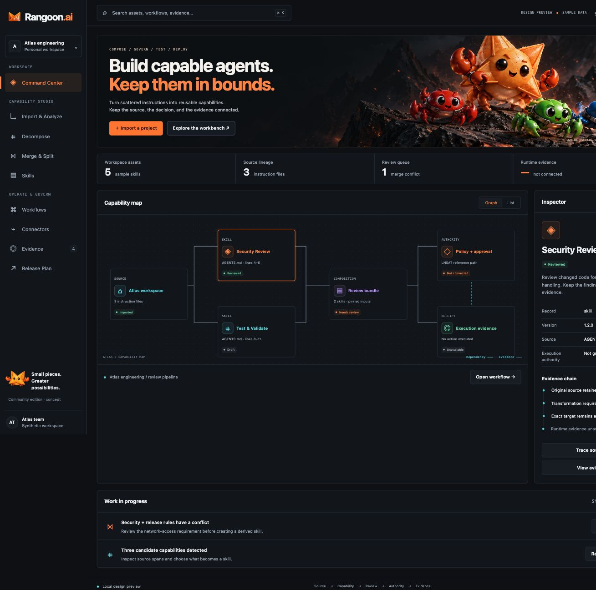

# Rangoon

Rangoon is a capability workbench for making AI instructions, skills, workflows, and connector plans understandable, portable, and reviewable. It is an application in development. This repository contains a synthetic interactive preview, a deterministic Rust source-analysis foundation, a Tauri desktop workbench, local source snapshots and reviewed skill revisions, and an inert engine-integration boundary. It is not a released desktop app or execution runtime.



The preview's V1 visual system uses a custom Foldline SVG icon family, a generated decorative capability illustration, and restrained dark/light motion with reduced-motion support. Inspect the local icon specimen at `http://127.0.0.1:4377/icon-gallery.html` after starting the preview, then run `npm run validate:visuals` to check the visual assets and contracts. See the [visual system specification](docs/visual-system.md) and [visual asset provenance](docs/visual-assets.json).

The product direction is a free, open-source workbench for developers and small platform teams managing `AGENTS.md`, `CLAUDE.md`, `SKILL.md`, rules, tools, hooks, and project context across repositories. The first desktop release is planned for macOS, Windows, and Linux together. A specific software license has not been adopted yet, so this repository makes no license grant.

## What exists now

### Interactive preview

The local preview has nine synthetic workbench views:

- Command Center
- Import & Analyze
- Decompose
- Merge & Split
- Skills
- Workflows
- Connectors
- Evidence
- Three-desktop release plan

It includes dark and light themes, narrow layouts, keyboard navigation, compact and focus modes, fixture-driven state changes, merge conflict review, inert draft compilation, and an explicit unknown-outcome workflow state. It uses sample data only. It does not read project folders, call providers, persist source snapshots, install anything, execute instructions, authorize actions, or connect to LNSAT. Its analysis route explains that browser preview analysis is disabled; the real selected-file and local-snapshot flow belongs to the native desktop spike below.

Run it with Node.js 20 or later:

```sh
git clone https://github.com/hypler-dev/rangoon.git
cd rangoon
npm start
```

Open `http://127.0.0.1:4377`. The **Rangoon** app uses the explicitly selected icon and a native startup screen. The branded [launch preview](preview/splash.html) is available at `http://127.0.0.1:4377/splash.html`. The preview server is local and dependency-free. Theme preference may remain in the browser; reloading resets the sample workspace. See the [preview gallery](docs/preview-gallery.md) for rendered dark, light, and narrow captures.

### Rust source-analysis foundation

The portable Rust slice accepts caller-supplied Markdown bytes on stdin and returns a deterministic JSON inventory. It preserves the exact source text, SHA-256 digest, display label, line count, section spans, and unreviewed fragment proposals. It recognizes a deliberately small Markdown subset: ATX headings, preambles, and fenced blocks. It is an inert source-analysis library, not a CommonMark parser, semantic extractor, harness compiler, policy engine, or executor.

Build and test it with Rust 1.85 or later:

```sh
cargo run --locked -p rangoon-cli -- analyze --name AGENTS.md < fixtures/contracts/AGENTS.md
cargo test --workspace --locked
```

The command opens no file. The shell supplies bytes through stdin; `--name` is a display label, never a path. `AGENTS.md`, `CLAUDE.md`, and `SKILL.md` receive format labels; other valid `.md` names are generic.

On macOS and Linux, ordinary redirection preserves the file bytes:

```sh
cargo run --locked -p rangoon-cli -- analyze --name AGENTS.md < fixtures/contracts/AGENTS.md
```

On Windows, use binary-preserving redirection from Command Prompt:

```bat
cargo run --locked -p rangoon-cli -- analyze --name AGENTS.md < fixtures\contracts\AGENTS.md
```

Text-mode PowerShell pipelines can change encoding or newlines before stdin reaches the CLI; the reported digest describes bytes actually received. The [contract fixture](fixtures/contracts/AGENTS.md) is safe sample text; its instructions remain data.

Successful output goes to stdout as JSON. Rejected input produces a fixed JSON error on stderr and a nonzero exit. The analyzer rejects invalid display names, non-`.md` names, NUL bytes, invalid UTF-8, oversized input, overlong lines, too many lines, and too many fragments. Limits are hard bounds: 256 KiB total source bytes, 10,000 logical lines, 16,384 content bytes per line, and 256 fragments. Input is rejected rather than silently truncated. An unclosed fence remains inert and is reported as a diagnostic. Empty input returns an empty report with an explicit diagnostic.

See [source-analysis.md](docs/source-analysis.md) for the complete experimental contract and [development.md](docs/development.md) for recorded validation evidence.

### Native selected-file analysis spike (R1b)

The desktop shell is a separate Tauri workspace under `apps/desktop`, using Rust 1.98 and the existing Rust analysis library. Run it from the application repository with:

```sh
cargo run --manifest-path apps/desktop/Cargo.toml --locked
```

Install the [Tauri native build prerequisites](docs/desktop-spike.md#run-from-source) for the host OS first. The native window opens a file picker for one Markdown file. The renderer supplies no path, source bytes, or options: the native side reads the selected file, returns its original source, fragments, digest, diagnostics, and fixed errors. Cancellation and failed replacement preserve the current report. An explicit **Save locally** stores one immutable source snapshot in unencrypted OS app-local SQLite; listing and reopening are real local records, while selection alone never writes. Identical basename and bytes deduplicate; changed bytes or basename create a separate snapshot. No provider request or upload occurs.

The three-OS source/build qualification matrix covers macOS, Windows, and Linux as work in progress. Current manual runtime evidence covers the macOS R1b path and R2a save/restart/reopen loop. Local source/storage checks passed; Windows/Linux GUI and release qualification remain pending. Three-OS source CI and a Mac GUI check are separate from all-three-OS release proof. There is no installer and no released OS support claim. See the [desktop spike record](docs/desktop-spike.md), [local workspace specification](docs/local-workspace.md), and [product-experience behavior contract](docs/product-experience.md#image-to-behavior-contract).

### Engine integration boundary (A1)

The application owns an inert `rangoon-engine` placeholder for a future LNSAT adapter. Its five closed operations return an explicit unavailable diagnostic with no network, filesystem, process, credential, mutation, or execution behavior. The native desktop exposes `get_engine_status` with no arguments; the CLI exposes `rangoon engine status` and `rangoon engine check --operation OPERATION`. Status reports the placeholder and unknown runtime state. `engine check` prints the unavailable diagnostic and exits 4. Neither command detects, installs, starts, authenticates, connects to, or retries an engine.

Open **Engine integration** in the real workbench, or preview its browser-unavailable state at `http://127.0.0.1:4377/analyze.html#engine`. Local analysis remains available independently. From source:

```sh
cargo run --locked -p rangoon-cli -- engine status
cargo run --locked -p rangoon-cli -- engine check --operation read_evidence
```

The second command deliberately exits 4: no engine evidence was read. This is Rangoon's experimental v0 application contract, not LNSAT's wire API or a release qualification claim. See the [engine integration specification](docs/engine-integration.md) and [application architecture](docs/application-architecture.md).

### Reviewed capability revisions (R2b)

The native Skills workbench derives a capability from one saved source section, retains immutable revisions and provenance, compares revision content, and records explicit local content review. Save a source in Import & Analyze, select a section, and choose **Create skill from section**. Later edits create an unreviewed successor while preserving the earlier content and review. Review records mean that a local operator inspected that revision; they do not grant authorship, validation, publication, execution, or other authority. Every result retains `authority: none`. The implementation caps each capability at 32 revisions, the workspace at 128 capabilities, and the database at 1,024 total revisions.

The macOS development-bundle check covered creation, review, editing, history comparison, quit/restart and reopen through real native commands. Windows/Linux GUI qualification remains pending. Browser-only Skills is explicitly unavailable; the separate nine-screen design preview still uses sample data. See the [native dark](docs/screenshots/r2b-skills-native-dark.jpg) and [native light](docs/screenshots/r2b-skills-native-light.jpg) captures.

Schema 1 remains source-only. The first explicit capability creation lazily upgrades a validated schema 1 store to schema 2 in the same immediate transaction; reads and listing do not migrate or create stores. Older binaries reject schema 2 rather than overwrite it. The source section and original bytes remain intact. Semantic decomposition, merge/split, and broader composition are still planned work. See the [reviewed capabilities specification](docs/reviewed-capabilities.md) and [development ledger](docs/development.md) for scope and validation state.

### Workspace data controls (R2c, published source)

The native Workspace surface provides bounded saved-data controls: usage counts, deterministic portable backups through a native save picker, additive restore with stale-preview checks, and dependency-aware logical deletion of saved sources or skills. Backups include saved sources, immutable revisions, and local review records; unsaved drafts are excluded. Restore never overwrites existing records or elevates authority, and deleting a referenced source is blocked with its dependent skills named. Logical deletion does not promise secure erasure, and original selected files are never modified. See the [workspace data-controls specification](docs/workspace-data-controls.md).

R2c source is published on `main` through PR #7. Isolated unsigned macOS QA proves the native backup/restore path, and synthetic populated browser checks pass at 320 and 768 pixels in dark/light themes. Windows/Linux GUI qualification, installer/released-OS support, and security claims remain pending. This work does not change licensing or engine activation.

### Composition core (R3 foundation)

The experimental `rangoon-compose` library provides deterministic content transformation over caller-resolved immutable inputs. It previews Decompose, Merge and Split recipes, preserves exact UTF-8 byte provenance, requires explanations for exclusions and replacements, checks deliberate duplication and complete input coverage, and blocks unresolved declared conflicts. Its identifiers are pinned by an independently constructed golden fixture. It has no database, native command, provider, network or execution behavior; results retain `authority: none`.

The initial core proposes new capabilities. A bounded application layer accepts closed destination requests for new, append and mixed outputs, validates exact current-head bindings and duplicate destinations, and derives deterministic application/output identities. PR #9 published this pure layer; PR #10 published validated revision-level provenance readback and saved-input previews; PR #11 published V2 backup, additive restore and dependency-aware deletion APIs. Each passed all fourteen exact-commit CI checks. The next local implementation adds atomic composition saves from retained Rust previews and versioned ordinary editing/review after schema 3 migration; its qualification and publication state is recorded in the development ledger. Existing native APIs remain unchanged and reject schema 3. The pictured **Update existing skill** destination still needs native confirmation and workbench integration. See the [composition contract](docs/composition.md), [destination contract](docs/composition-destinations.md), [recovery refinement](docs/composition-recovery.md), [workbench design](docs/composition-ui.md), and [validation ledger](docs/development.md).

## Product boundary

Rangoon owns the user-facing lifecycle: discovery, provenance, editing, decomposition, composition, compatibility, static tests, compilation planning, review, and evidence views. LNSAT remains an independent reference authority and evidence engine. Rangoon does not copy LNSAT implementation or recreate its authority semantics in UI code. A future qualified adapter may reference exact LNSAT contracts; the present preview and analyzer do not connect to it.

Management must remain useful when execution is unavailable. Imported files are data, not commands. Future import, provider, compiler, connector, and authority paths require explicit contracts, bounded inputs, visible review, and evidence. A UI field, model response, credential, test pass, or subscription entitlement cannot by itself authorize a consequential operation.

## Current versus planned

| Area | Current evidence | Planned work |
| --- | --- | --- |
| UI | Local synthetic browser preview with nine views and dark/light states; native R1b analysis view | Qualify the native shell and bridge on macOS, Windows, and Linux |
| Import | Bounded stdin analysis plus one explicitly selected native Markdown file; no directory scan | Broader discovery and a persistent local workspace beyond R2a |
| Workspace data | R2c source is published on main; isolated unsigned macOS QA and synthetic populated browser checks pass | Cross-platform GUI qualification, installer/released-OS evidence, and later workspace evolution |
| Editing | R2b derives saved sections into immutable capability revisions with explicit local review; PR #6 is merged with all 14 checks passed | Windows/Linux GUI qualification, semantic decomposition, merge/split, lineage expansion, and reversible composition |
| Compatibility | No production adapters | Versioned harness adapters with golden fixtures and visible unsupported fields |
| Testing | Static preview tests and Rust source-analysis tests | Deterministic bundles, fixture simulation, static test lab, and export evidence |
| Engine integration | A1 inert `rangoon-engine` boundary; native status and CLI status/check diagnostics only | Later qualification gates for a supported LNSAT 1.0 artifact and adapter |
| Execution | No executor, provider call, connector call, or deployment | Only qualified governed operations through an explicit authority and enforcement path |
| Distribution | No installer or released OS support; Windows/Linux GUI qualification and release proof remain pending | Fresh-host qualification, signing, update, rollback, and release proof for all three OSs |

R3 real Decompose/Merge/Split work continues under the accepted V1 objective. The pure core is an implementation stage; persistence, both output destinations and native workflows remain open.

These distinctions are deliberate. A buildable artifact, a browser capture, or a passing source test does not establish desktop support, native enforcement, security certification, or production readiness.

## Architecture direction

The proposed shape is a modular monolith: the current vanilla-JS workbench evolves incrementally toward typed shared UI where useful, Rust owns application services and native boundaries, and Tauri remains the shell after a three-OS qualification spike. A framework rewrite is not a prerequisite. R2a uses unencrypted SQLite under the OS app-local data directory, bounded to 128 snapshots, 256 KiB per source and a 64 MiB database; R2b adds a lazy schema 2 capability store on first explicit creation. Broader local workspaces, content-addressed artifacts, a service boundary and authenticated workers remain planning targets:

```text
apps/studio/                 shared React + TypeScript UI
apps/desktop/                Tauri shell and scoped native bridge
apps/server/                 Rust API, service composition, job supervisor
crates/rangoon-domain/       capability revisions, provenance, compatibility
crates/rangoon-import/       bounded inert discovery and parser isolation
crates/rangoon-engine/       inert engine status and unavailable-operation port
crates/rangoon-jobs/         durable jobs, leases, cancellation, recovery
packages/contracts/          versioned schemas and generated types
packages/adapter-kit/        importer/compiler/runner conformance fixtures
adapters/                    independently versioned harness and connector adapters
fixtures/                    secret-free source corpus and hostile inputs
docs/                        decisions, support matrix, evidence, runbooks
```

The current Rust crates are the first small foundation under this direction. The full tree is not scaffolded by this preview.

## Roadmap

The roadmap is proposed in [plan.md](docs/plan.md). Its sequence is:

1. Select a license, freeze contracts, and qualify the desktop shell and native bridge on all three operating systems.
2. Extend R2a durable local source snapshots into safe, explicit import with hostile-input coverage and recovery evidence.
3. Add capability IR, editing, lineage, merge/split, and provenance.
4. Add pinned harness adapters and visible compatibility results.
5. Add static tests, fixture simulation, deterministic export, and evidence bundles.
6. Qualify a free desktop alpha on macOS, Windows, and Linux.
7. Separately qualify one disposable governed operation through an accepted LNSAT path.
8. Extend to owner-hosted teams, an extension SDK, and later enterprise service boundaries only after their own evidence gates.

No roadmap item changes LNSAT, grants a license, claims released OS support, or authorizes production or government operations.

## Security and privacy boundary

The portable analyzer performs no network access, persistence, filesystem scanning, model/provider call, script execution, package installation, hook execution, authorization, or external write. The desktop spike reads only one explicitly selected file. R2a stores source only after explicit Save locally, unencrypted on this computer, and reanalyzes bytes on reopen. It does not scan directories or upload source. Its output includes original source content and is therefore a local analysis artifact, not redacted telemetry. Keep sensitive files out of shared logs and exports.

Future import and remote-analysis work must keep prompt-injection content as data, validate outputs against schemas, show payload and retention choices, and distinguish unreadable or excluded files from an empty project. Native bridges must expose narrow selected-folder and approved-output operations rather than a generic shell. Credentials belong in OS secret stores or an explicitly reviewed fallback. A subprocess is not automatically a sandbox.

Rangoon and LNSAT stay separate stores and trust boundaries. Nothing here claims security certification, compliance approval, domestic processing, or government endorsement. See [claims and evidence](docs/claims-and-evidence.md) for the current LNSAT audit boundary.

## Development and contribution

Read [intent.md](docs/intent.md) first, then [plan.md](docs/plan.md), [development.md](docs/development.md), [reviewed-capabilities.md](docs/reviewed-capabilities.md), [engine-integration.md](docs/engine-integration.md), [application-architecture.md](docs/application-architecture.md), and [validation.md](docs/validation.md). Keep changes small, scoped, and evidence-backed. Include the exact commands and results for behavior you change. Preserve synthetic fixture labels and separate implemented behavior from proposals. Do not add secrets, customer data, provider payloads, deployment state, or claims of certification.

Useful checks from the repository root:

```sh
npm run check
npm test
node scripts/validate-review.mjs
cargo fmt --all -- --check
cargo test --workspace --locked
cargo clippy --workspace --all-targets --locked -- -D warnings
git diff --check
```

The Node checks cover the local preview and server. The Rust checks cover the source-analysis foundation. They do not qualify installers, native interactions, released platform support, LNSAT runtime behavior, or production execution.

## Documentation index

- [Accepted intent](docs/intent.md) — scope, constraints, boundaries, and acceptance.
- [Architecture and roadmap](docs/plan.md) — proposed product shape, support matrix, and build packets.
- [Source register](docs/sources-and-features.md) — recovered requirements and evidence sources.
- [Claims and LNSAT evidence](docs/claims-and-evidence.md) — maturity, proof gaps, and safe wording.
- [Source-analysis contract](docs/source-analysis.md) — input limits, parser subset, records, and errors.
- [Development status](docs/development.md) — current implementation and validation receipts.
- [Reviewed capabilities](docs/reviewed-capabilities.md) — R2b revision, provenance, review, schema, and limit contract.
- [Validation and review](docs/validation.md) — command results, browser QA, review scope, and limitations.
- [Desktop spike](docs/desktop-spike.md) — native selected-file analysis boundary, prerequisites, and qualification limits.
- [Engine integration](docs/engine-integration.md) — A1 inert port, diagnostics, and LNSAT qualification boundary.
- [Application architecture](docs/application-architecture.md) — module ownership, workflow records, and staged engine adoption.
- [Product experience](docs/product-experience.md) — image-to-behavior contract and first useful file lifecycle.
- [Preview gallery](docs/preview-gallery.md) — rendered synthetic screens.
- [Visual system](docs/visual-system.md) — Foldline icons, motion, themes, and decorative asset rules.
- [Visual assets](docs/visual-assets.json) — generated asset provenance and hashes.
- [Visual provenance](docs/artwork.md) — source and derived asset records.
- [Funding research](docs/government-funding.md) — research plan, not eligibility or submission.
- [Review submission](docs/review-submission.md) — packet review proposal.

The marketing website is maintained in a separate checkout. This repository is the application repository under development.
