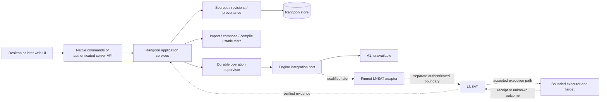

# Rangoon application architecture and LNSAT adoption

Authority: [intent.md](intent.md), October 5 engine architecture continuation. This is the architectural review and build sequence supporting the implemented [A1 integration boundary](engine-integration.md). Long-term stages are recommendations, not claims of implementation, release qualification or permission to activate external systems.

Owner: Jeff. Architecture, trust boundaries, schema, integration and release decisions remain with the primary controller. Validation/publication state belongs in [development.md](development.md).

## Purpose and first useful outcome

Rangoon should turn scattered agent instructions into understandable, reusable capabilities, then make the change from an idea to a deployed or executed action inspectable. Its first useful promise is: **know what an agent is configured to do, where those instructions came from, and what a proposed change will preserve or lose.** That is valuable without a running LNSAT engine, a model account or a cloud subscription.

The supplied images describe a connected product lifecycle, not twenty unrelated dashboards. Import, Decompose, Merge/Split, Skills and Workflows should operate on the same versioned records. Command Center summarizes those records and real operation states. Connectors expose precisely available operations and authority boundaries. Test Lab, Compile, Deploy and Audit should show the actual evidence produced by their respective services. Sample numbers and decorative graphs must give way to useful empty, unavailable and recovery states as each real service arrives.

## Core decisions

1. **One modular application, three desktop operating systems.** Keep the existing Rust domain/services and scoped Tauri host. Evolve the current vanilla-JS workbench into a shared typed UI incrementally when the revision editor needs it; a framework rewrite is not a prerequisite for useful features. No second desktop shell or separate Windows product.
2. **Content management is independent of execution authority.** Rangoon owns source, assets, review, composition, compatibility, jobs and their presentation. LNSAT remains the independent authority/evidence boundary. A disabled LNSAT adapter must not block local reading, editing, comparison or export.
3. **One authoritative record per concern.** Immutable source and asset revisions in Rangoon; authority decisions and consequence evidence in LNSAT or another explicitly qualified provider. The graph, counters, search index and UI are derived views. Never use an engine database as a shared application database.
4. **Ports precede integrations.** Format importers, compilers, analysis providers, connectors, execution targets and authority providers have separate interfaces. Their availability and tested capability subsets are explicit. A logo, credential or installed package does not imply an operation is supported or authorized.
5. **Build safe content work now; qualify authority work separately.** A1 provides honest unavailable functions. It does not recreate LNSAT behavior with a permissive mock while waiting for 1.0.

## What exists and where the application grows

| Component | Responsibility | Current state and next boundary |
| --- | --- | --- |
| `preview/` workbench | Source/section inspector, saved sources, Skills, composition editors, Workspace, Compile inspection, integration status and launch; separate synthetic design surfaces | Real saved-content routes coexist with nine clearly separated sample design screens; native GUI qualification remains incomplete |
| `apps/desktop` | Window lifecycle, explicit file selection, trusted app-local path, narrow commands | Implemented host; no generic shell, renderer paths or native credential API |
| `rangoon-domain` | Byte identity, spans, source and fragment report types, capability revision contracts | R2b capability/revision contracts implemented and locally tested; macOS lifecycle checked |
| `rangoon-import` | Deterministic bounded parsing of caller-supplied bytes | Implemented Markdown subset; bounded folder/archive inventory later |
| `rangoon-host` | Safe read of the explicitly selected local file | Implemented; broader grants require separate rooted-read design |
| `rangoon-store` | Rangoon-local transactional repository | Schema 1/2/3 snapshots, revisions/reviews, composition, backup/restore and deletion; R4a read-only stored-revision compilation; no compiler schema migration |
| `rangoon-compose` | Pure recipes, coverage and destination application | Decompose/Merge/Split over pinned inputs; full GUI/release qualification remains in the ledger |
| `rangoon-compile` | Pure instruction artifacts, compatibility diagnostics and candidate identities | R4a exact-byte AGENTS.md/CLAUDE.md profiles; native Compile inspection through a narrow host command; portable export and actual target-loader qualification pending |
| `rangoon-engine` | Application integration status and engine-dependent port | A1 inert placeholder; no transport, detection or authority |
| `rangoon-cli` | Headless use of the same application functions | Source analysis and A1 diagnostics; capability commands are native desktop only; no alternate execution path |
| Future application service | Coordinate revisions, validation, jobs and projections | Extract from host when the second real workflow appears; host and server must call the same use cases |
| Future job supervisor | Durable attempts, cancellation, bounded concurrency and recovery | Required before long-running analysis, real test runs or connectors; not needed for a constant A1 status |
| Future server | Authenticated workspace and worker API | Later self-hosted phase; not an HTTP wrapper around privileged Tauri commands |

Dashed paths are planned. No live engine/executor path exists in A1. The exact future engine-to-executor topology must follow the accepted LNSAT contract; the diagram is a boundary model, not a claim of an already released route.

## Records and state transitions

| Record | Identity, ownership and rules |
| --- | --- |
| Source snapshot | Current R2a identity binds basename and exact bytes; immutable, original digest retained. No absolute path is saved. A source digest is not authenticity or permission. |
| Project | Future stable ID grouping source references, target adapters and local preferences. A project is not a filesystem grant or tenant. Root bindings need their own explicit selection and revocation. |
| Proposal | Candidate extraction, split or merge with exact source spans, generator version and unresolved coverage. It can be rejected without losing the source. |
| Capability and revision | Stable capability ID plus immutable revision. Content, dependencies and requirements have independent review state. Review records who accepted a particular revision; it does not approve execution. |
| Provenance edge | Exact input revision/span to output revision, derivation type and tool version. Every edit retains its inputs; deleted/unassigned source is visible. |
| Composition / workflow | References exact revisions and a typed graph, including branch, input/output mapping and human checkpoints. Pin definitions independently from run state. |
| Compatibility report | Target/version/adapter digest, preserved/adapted/unsupported concepts, diagnostics and tests. Unsupported security-sensitive meaning blocks compilation. |
| Bundle / export plan | Canonical normalized manifest and file digests plus original source digests, destination grant and expected existing state. Export and activation are separate operations. |
| Job / attempt | Stable job ID, input revision, attempt ID, cancellation request, lease, state and result references. The next attempt is a decision, not an automatic consequence of a timeout. |
| Engine evidence reference | Provider identity, exact external ID, contract version, observation time, integrity/freshness status and bounded raw evidence. Do not convert an app cache into an engine-issued receipt. |

Content lifecycle: `source snapshot → proposal → reviewed capability revision → pinned composition → validated bundle → explicit export`. An edit creates a new revision and invalidates dependent validation; it does not mutate the previous reviewed revision in place. A comparison can explain additions, moved spans, exclusions and unresolved conflicts before acceptance.

Execution lifecycle is separate: `planned → awaiting engine decision → awaiting human approval if required → eligible for bounded consumption → submitted → succeeded / failed / outcome unknown`. These are conceptual states until the exact engine contract is bound. “Approved” is never a synonym for “executed.” Unknown effect requires reconciliation; a crash, cancellation or lost response cannot be presented as proof that nothing happened. No automatic retry of consequential work after an uncertain outcome.

## Make the images work as one application

| Surface | Actual user action and application work | LNSAT dependency | Failure and completion evidence |
| --- | --- | --- | --- |
| Import & Analyze | Select a file now; later choose a bounded project root. Inventory bytes without executing scripts/hooks. | None for local parsing and save | Actual inventory, rejected/unreadable files, exact digests; no silent partial success |
| Decompose | Mark source spans, propose reusable capability boundaries, review missing coverage, accept revisions | None for manual/deterministic work; optional analysis has a separate provider/egress policy | Original text remains accessible; no fabricated confidence percentage |
| Merge & Split | Preview derivation graph, resolve competing constraints, preserve input revisions, accept new revisions | None for content transformation | Coverage ledger plus unresolved conflicts; undo restores references, not destructive history rewrite |
| Skills | Inspect, edit and compare exact capability revisions and usage | None for catalog/review | Review, tests and target compatibility are distinct badges; “published” alone is insufficient |
| Workflows | Compose typed nodes and branch data; validate dependency cycles and missing inputs | None for authoring/static validation; required for governed effects | Static simulation clearly labeled; real runs use durable attempts and engine evidence |
| Connectors | Inspect operation manifests, required credentials by reference, target scope and tested support | Required for a managed consequential operation | Credential presence is not connected/authorized; timeout is unknown when effects are possible |
| Test Lab / Simulations | Static rules, golden fixtures, deterministic replay; later isolated real harness trials | Not required for pure fixtures; required where a trial can have governed effects | Separate static, simulated and actual evidence; show test inputs/version/environment |
| Compile / Deploy | Compile reviewed content, preview output diff and semantic loss, export to selected directory; later explicit activation | Pure compilation does not need engine; activation depends on exact target and managed boundary | Target drift aborts apply; rollback covers declared reversible effects only |
| Command Center / Audit | Summarize real workspace jobs and exact authorized engine evidence | Only engine-derived sections | Empty/unknown/stale states instead of sample “98.6% compliant”; every metric has denominator, period and source |

Ease of use comes from progressive disclosure: show the next useful action and why it is blocked; retain context through failure; let users get back to their source. Keep one primary action per stage. Show provenance/conflicts alongside the editor when they matter, not as a required security tutorial on every screen.

## LNSAT findings that change the integration plan

Inspected public source: [`e09a6b02634b04a46f861ed8b092acc2c2e50fe8`](https://github.com/hypler-dev/LNSAT/tree/e09a6b02634b04a46f861ed8b092acc2c2e50fe8). This is a dated source review, not a runtime test or completion assessment. Product 0.1.0, wire `v1_0`, feature surfaces and storage schema must not be collapsed into a “version 1 ready” badge.

| Finding at this commit | Consequence for Rangoon | Source |
| --- | --- | --- |
| Exact `LNSAT-Contract-Version` negotiation, ordered boundary gates, no automatic version downgrade | Pin and reject incompatible responses; version match does not bypass authentication or policy | [Gateway negotiation](https://github.com/hypler-dev/LNSAT/blob/e09a6b02634b04a46f861ed8b092acc2c2e50fe8/docs/architecture/GATEWAY_V1_CONTRACT_NEGOTIATION.md#L12), [versioning](https://github.com/hypler-dev/LNSAT/blob/e09a6b02634b04a46f861ed8b092acc2c2e50fe8/docs/reference/CONTRACT_VERSIONING.md#L20) |
| Browser session token and independent proof headers; ambient cookies withdrawn | Future transport and secret custody need a dedicated native design. Never send tokens/proof through the renderer, content store or logs | [Header boundary](https://github.com/hypler-dev/LNSAT/blob/e09a6b02634b04a46f861ed8b092acc2c2e50fe8/docs/architecture/SECURITY_LOOPBACK_BROWSER_SESSION_HEADER_HARDENING.md#L20) |
| Authenticated Unix socket path withdrawn pending accepted mutual authentication | Do not build on a convenient local bearer socket, same UID or pathname as peer identity | [Local auth withdrawal](https://github.com/hypler-dev/LNSAT/blob/e09a6b02634b04a46f861ed8b092acc2c2e50fe8/docs/architecture/SECURITY_LOCAL_AUTH_AVAILABILITY_AND_UDS_WITHDRAWAL.md#L14) |
| Headless declarations are bounded, closed-schema and narrowing; effective/export remain diagnostic, export non-reimportable | Configuration preview cannot become an “Apply policy” button; own draft editing separately from engine validation/admission | [Configuration specification](https://github.com/hypler-dev/LNSAT/blob/e09a6b02634b04a46f861ed8b092acc2c2e50fe8/docs/architecture/headless-configuration/spec.md#L42) |
| Exact approval-request, decision and audit-event reads; `ReadEvidence`, no search/list/query on these routes | Begin with exact evidence lookup after transport qualification. Do not invent global approval lists or polling endpoints | [Monitoring specification](https://github.com/hypler-dev/LNSAT/blob/e09a6b02634b04a46f861ed8b092acc2c2e50fe8/docs/architecture/headless-monitoring/spec.md#L12) |
| SDK packages are private, unpublished source references; MCP is an adapter | No npm installation claim or embedding a second authority engine; actual adapter needs a pinned supported distribution/interface | [SDK inventory](https://github.com/hypler-dev/LNSAT/blob/e09a6b02634b04a46f861ed8b092acc2c2e50fe8/docs/sdk/README.md#L10), [TypeScript boundary](https://github.com/hypler-dev/LNSAT/blob/e09a6b02634b04a46f861ed8b092acc2c2e50fe8/docs/sdk/typescript-reference.md#L30) |

The source review shows useful existing contracts and several still-gated runtime/control lanes. It does not substantiate a percentage-complete claim. Some diagnostic file-identity paths are Linux/macOS-specific; Windows Rangoon content management remains an initial-release target, while each Windows engine-dependent operation needs independent evidence.

## Build now, replace placeholders deliberately

| Stage | Concrete delivery | Exit gate |
| --- | --- | --- |
| A1 now | Inert `rangoon-engine` port, CLI and real native status, five unavailable seams, integration page and this map | No connection attempted, no grant/success output, bad/future UI status fails closed; tests and native/browser evidence |
| R2b current | Reviewed capability revisions derived from saved snapshots, exact span coverage, compare/revise and local review | Source tests and independent review passed; macOS lifecycle passed. Windows/Linux GUI qualification remains pending. See the development ledger for immutable original, stale-revision rejection, content-bound local review and recovery evidence |
| R3 | Real Decompose and Merge/Split over these revisions | Conflict and excluded-span accounting, version history, reversible edits; no silent policy weakening |
| R4/R5 | R4a pure instruction compiler and stored-revision service, followed by Compile UI, broader profiles, deterministic bundle and explicit export | [Compiler contract](compilation.md) defines initial byte-preserving subset; golden/negative fixtures, meaningful loss report, target qualification, selected destination and drift/collision handling on all three OSs remain distinct gates |
| A2 | Qualified engine transport and exact compatibility/readiness inspection | Accepted peer authentication, secret custody, no renderer credentials, explicit feature matrix, hostile-response/redirect/origin/version tests |
| A3 | Diagnostic configuration and exact evidence readback | Validated request/response fixtures, exact IDs, redaction, freshness/integrity state; reads never become authorization |
| A4 | One disposable governed operation and reconciliation | Exact request/decision/approval/consumption/receipt chain; crash before/after effect, replay, expiry/revoke and unknown-outcome tests |
| R6 | Free desktop alpha for macOS, Windows and Linux | Clean-host GUI/install/update/uninstall, signing and rollback, source/asset backup restore, accessibility and license decision |
| R8+ | Owner-hosted teams, then managed enterprise | Authentication/tenancy/jobs/storage/backup and operational evidence; no automatic inheritance from desktop |

A2–A4 can be specified against current source, but enabling them depends on their own evidence, not a date or product name. R2b–R5 should continue while LNSAT matures. License adoption, releases and external activation remain separate human decisions.

### LNSAT 1.0 intake checklist

1. Identify the actual signed/reproducible supported artifact, source commit, license, supported OS/architecture and dependency provenance. A tag or README alone is insufficient.
2. Compare product, wire and feature-surface contracts with the pinned reference. Record removed/changed fields, routes, errors, session and consequence semantics. Use exact accepted compatibility, never guess from semver or silently downgrade.
3. Implement one adapter behind the port with operation-specific types. Keep engine-issued opaque IDs and original evidence; do not normalize away authority-critical distinctions. No generic URL/request escape hatch.
4. Qualify peer identity, transport, expiry/rotation/revocation, native secret custody, redaction and unavailable-store behavior. Loopback and a desktop process are not by themselves authentication. Do not reuse withdrawn UDS or ambient cookies.
5. Run contract fixtures and real isolated integration tests per supported operation and OS. An installed engine, healthy endpoint or successful read does not enable writes.
6. Enable exact read-only capabilities first. Require independent end-to-end consequence and recovery evidence before A4. No public/prod target is needed for this qualification.
7. Publish a capability matrix with tested engine artifact, adapter version, target OS and evidence. Show stale or incompatible states explicitly. Keep local content management available during engine outages and upgrades.

## Desktop, self-hosted and enterprise evolution

The initial desktop release targets macOS, Windows and Linux together. Current CI proves source/build subsets; manual source-workspace runtime evidence is macOS only. Engine availability is an independent matrix. Do not delay offline Windows editing because a Linux engine executor qualifies first, or call Windows enforcement supported because the UI builds there.

For the self-hosted phase, extract the same application use cases into a Rust service with authenticated API handlers. Introduce actor/workspace/tenant context at the service boundary, per-tenant storage access, authorization tests and job ownership before shared hosting. Tauri local commands and HTTP handlers must both call typed services; HTTP must not expose raw native commands or host paths.

SQLite remains appropriate for the bounded single-user app. A later PostgreSQL/object-store implementation requires explicit transaction, migration, quota, backup and concurrency semantics; it is not a connection-string swap. Local-to-server migration needs an explicit export/import manifest, content digests, ownership mapping and conflict plan. Bidirectional offline sync is deferred until revision conflict semantics exist. Secrets and engine authority records must not ride along with content sync.

Separate control and execution environments. An authenticated remote worker needs a registered identity, bounded operation, cancellation/lease semantics and evidence channel. Network partitions must leave work visibly unknown where effects could have occurred. Hosted multi-tenancy, regional processing, air-gapped delivery and enterprise recovery each need separate qualification. LNSAT's initial headless design does not automatically provide those features to Rangoon.

Keep core provenance, local review, export, safe failures and authority boundaries in the free product. Potential paid value is collaboration, SSO/SCIM, managed operations, fleet coordination, support and retention controls. Entitlement never grants action authority. Specific licensing and enterprise scope remain owner decisions.

## Extension and standards strategy

Use versioned, independently tested adapters instead of claiming universal interchange. Start with deterministic text transforms and pinned Codex/Claude-style fixture subsets; unsupported meaning stays visible. An SDK comes after two real adapters reveal the right abstraction.

| Family | Contract to establish before execution |
| --- | --- |
| Importer | Accepted byte formats, hard bounds, source coverage, no imported execution, deterministic diagnostics |
| Harness compiler | Canonical IR subset, target/version, loss report, reproducibility, golden fixtures and output confinement |
| Analysis provider | Explicit selected payload, egress/retention/cost policy, schema validation, cancellation; suggestions have no authority |
| Connector / runner | Operation schema, declared effects, target scope, credentials by reference, limits, idempotency evidence and reconciliation |
| Authority provider | Exact request/digest binding, identity, expiry, revocation, one-time consumption and verifiable evidence; no fallback provider on failure |
| Deployment adapter | Desired/current state, drift precondition, bounded apply, activation distinction and declared rollback limits |

MCP is a tool/interface adapter, OpenAPI describes an API, and A2A may support future remote interoperability; none creates permission to act. Adopt them only for a concrete supported integration with pinned versions and tests. Package signatures and SBOMs help distribution provenance, not runtime authorization. Telemetry needs redacted structured events and opt-in content handling; do not export instruction text, tool arguments or session material by default. Standards mappings for government or enterprise claims require actual evidence, not a badge.

## Claims, research and next proof

The defensible current statement is that Rangoon can inspect and explicitly save bounded local Markdown source, retain byte provenance, and expose honest unavailable engine seams. “Governed platform” describes the direction until a qualified operation path exists. The [claim register](claims-and-evidence.md) and [government funding plan](government-funding.md) remain the funding evidence sources; this architecture does not claim certification, eligibility or a submitted application.

Research-worthy proof should measure semantic preservation across target formats, provenance completeness under merge/split, success at preventing consequence bypass in a defined threat model, and recovery of unknown effects. Compare against a documented baseline, retain negative fixtures and report limitations. UI completeness, test counts and a matching wire version cannot substitute for those results.
