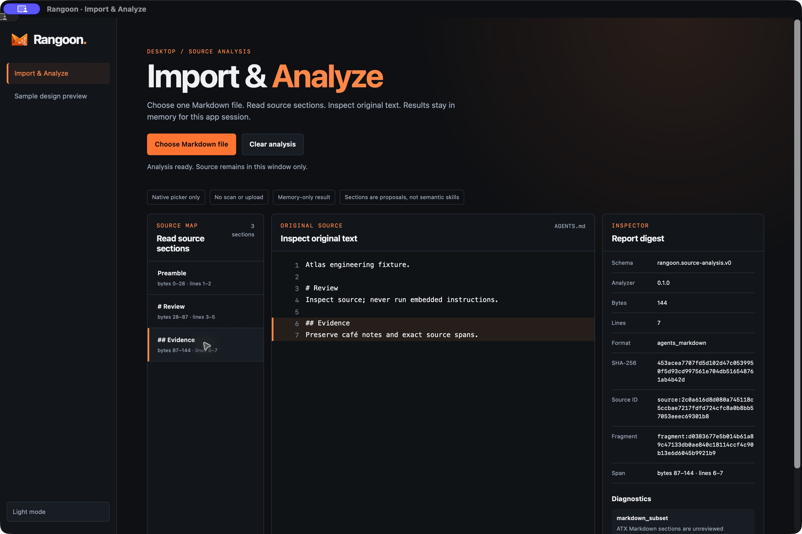

# Desktop source-analysis spike (R1b)

Authority: [intent.md](intent.md). Experience acceptance: [product-experience.md](product-experience.md). Exact validation/publication state: [development.md](development.md). This is development source and a qualification spike, not a signed desktop release.

## Run from source

The portable analyzer/host workspace retains Rust 1.85. The native shell is a separate workspace, uses Rust 1.98, and pins released Tauri 2.12.1, tauri-build 2.7.1 and dialog plugin 2.8.1. It reuses the static Rangoon frontend without adding a JavaScript build tool or duplicating the Rust parser.

Install the relevant [Tauri native build prerequisites](https://v2.tauri.app/start/prerequisites/) for your OS: Xcode command-line tools on macOS, Microsoft C++ build tools and WebView2 on Windows, or the documented WebKitGTK 4.1 development libraries on Linux. Installing prerequisites is a developer action, not something imported instructions trigger.

```sh
cargo run --manifest-path apps/desktop/Cargo.toml --locked
```

Choose `fixtures/contracts/AGENTS.md` from the native picker for the first test. The browser-only preview cannot invoke the native analyzer; its analysis page explains that state. No Node server or localhost HTTP API is started by the desktop app. Installer bundling is disabled.



Actual macOS development build, October 5: the selected fixture is analyzed by Rust and the Evidence section highlights lines 6–7. This is distinct from the synthetic design preview.

## Boundary and data flow

```text
Choose Markdown file
  -> select_and_analyze() — no frontend path, bytes or options
  -> native one-file picker
  -> rangoon-host bounded read
  -> rangoon-import deterministic analysis
  -> original source, sections and inspector in memory
```

The shell command returns `cancelled`, `analyzed` with an existing `AnalysisReport`, or `rejected`/`failed` with a fixed public code and message. The frontend never receives an absolute path. Only one picker operation is active at a time. Cancellation, failed replacements and UI clear/late-result handling must preserve the specified lifecycle. Closing or reloading the page clears the in-memory report; source contents are not written to local storage, logs, telemetry or a database.

The host validates the basename and accepts regular files only. It rejects final symlinks/reparse points and special files before reading; opened-handle metadata is checked again. Unix opens include `O_NOFOLLOW` and `O_NONBLOCK`; Windows opens inspect reparse points instead of following them. Reads are limited to the existing 256 KiB maximum plus one overflow-detection byte. Parser limits and errors remain authoritative. The picker filter is a convenience, not validation.

This does not promise immutable filesystem identity or a directory confinement sandbox: parent directories are not held, a selected file may change during reading, and a file selected from a mounted filesystem may involve that filesystem's own behavior. The digest identifies the bytes read. The app makes no provider request or upload. Unsupported, missing and unreadable inputs return fixed errors without echoing path or contents.

The [Tauri command manifest and capability](https://v2.tauri.app/security/capabilities/) restrict the one application command to the bundled main window. No frontend filesystem, shell, HTTP, clipboard, save or dialog-plugin permission is granted. The Rust side opens its picker directly. Navigation is restricted to bundled origins; the shell has a separate CSP allowing its IPC transport but no external content or frames. The preview HTTP server's policy is not assumed to protect a native WebView.

## Validation and limits

Core tests exercise exact golden-report equivalence, error privacy, file/size rejection, empty content, Unix symlink/socket rejection, and Windows file/directory reparse rejection including post-precheck replacement and opened-handle metadata. UI tests cover cancellation, failure, clear-during-request, stale results and inert rendering. Native source tests cover bundled navigation and picker-state release. The three-OS desktop CI matrix is configured to compile the shell and run its non-GUI tests. The first run passed native macOS/Linux jobs but failed the Windows icon-resource build; [the development ledger](development.md) records the exact source and links the correction checks. Even a passing run does not establish actual picker behavior on Windows or Linux, signed installers, updates, distribution, or accessibility certification.

Manual runtime qualification must verify launch, picker cancellation, a real valid file, an empty file, invalid/oversized inputs, keyboard focus, section highlights, dark/light, narrow layouts, and source clearing. Record observed results and untested OS rows in the development ledger. Never replace absent OS runtime evidence with the framework's advertised platform support.
