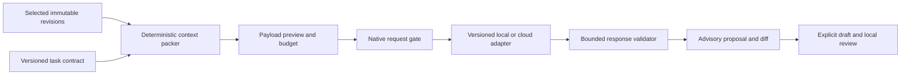

# Optional model assistance and context packing

Authority: Jeff's October 6, 2026 request recorded in [intent.md](intent.md). The feature is accepted product scope; the design below is the controller's implementation contract, not a claim of complete connectivity or security qualification. Evidence belongs in [development.md](development.md). This port is separate from the unavailable LNSAT authority port.

The first pure stage, M1a, is implemented in `rangoon-model-assistance` under the frozen [context-pack and response specification](model-context-core.md). It supplies bounded context packing and inert proposal validation only. The `rangoon-model-local` library adds immutable numeric-loopback profiles, final request binding, bounded explicit transport and strict outer-response validation under the [local adapter contract](model-local-adapter.md). The `rangoon-model-session` crate adds portable session-only custody and saved-record resolution around those libraries, and the native host now wires the actual `#model-assistance` workbench. Seven local main commands and three isolated local review commands enforce native window labels, exact payload review, final parented OS consent, cancellation and freshness. Native output remains advisory and inert. Native cloud orchestration is source-implemented with its own ten bounded commands, full-envelope custody and final consent; provider compatibility, three-OS credential custody qualification, proposal application, tokenizer/quality qualification, and native GUI/release support remain open. M1b/V1 are incomplete. The provider-neutral pack body is not an authorized or complete provider request.

The portable `rangoon-model-cloud` library now implements fixed-origin OpenAI Responses HTTPS transport under the [cloud adapter contract](model-cloud-adapter.md). It binds exact request bytes and a credential revision, verifies TLS before authentication, bounds transport/JSON, and validates advisory proposals against the retained pack. It does not read OS credentials or establish native consent; `apps/desktop/src/cloud_models.rs` supplies those native gates and explicit cloud dispatch. Real provider compatibility and GUI/release qualification remain unqualified.

## Portable session foundation

The [native session contract](model-native-session.md) defines the portable API. The [native workbench contract](model-native-workbench.md) defines the implemented command, review-window, consent and freshness boundary.

`rangoon-model-session` implements library custody only. `LocalSession` clones share one in-memory state with one optional `LocalProfile`, one retained immutable prepared request and at most one active operation. `configure`, `inspect`, `clear` and `cancel` manage profile and generation state; `begin_prepare`, `begin_check` and `begin_send` reserve the operation slot. No session state is persisted.

Preparation accepts only the closed `rangoon.local-selection.v1` selector. It resolves exact saved source IDs or explicit capability/revision IDs through `Workspace`, retains dependency digests and observed capability heads, and packs each nonempty record as one full-content protected selection. Empty records return `input_empty`; records are never fabricated, truncated or heuristically narrowed. `PreparedView` exposes exact request metadata and pack accounting while keeping custody private.

Run and prepared handles are cryptographically random 32-byte values with `run:` or `prepared:` prefixes. Prepared handles are consumed by `begin_send`; retries require a new preparation. Checked monotonic generations, cancellation tokens, non-cloneable operations and matching RAII leases prevent stale completion from owning newer state. `Transmission::freshness` can be called before dispatch and after response to compare retained dependencies, returning `current`, `stale` or `unavailable` while rechecking operation validity.

This crate makes no network calls, shows no native dialog, and does not establish consent, endpoint authentication, model compatibility, security qualification or authority. The native host supplies the caller, reviewed confirmation, workspace guard and transport sequence for local and cloud paths. The local and cloud native paths are source-implemented; qualification remains bounded and cloud provider compatibility, GUI and release evidence remain open.

The separate `rangoon-model-session::cloud::CloudSession` implements cloud-only memory custody under [model-cloud-session.md](model-cloud-session.md). It shares validated saved-record resolution and protected context packing, but requires cloud-specific schema tags, handles and the exact native-supplied credential revision. It exposes exact retained outer request metadata, single-use ownership, a source-free check operation lease and freshness helpers. It has no credential access or network I/O. Native full-envelope comparison, shared local/cloud operation serialization, isolated cloud review and final OS transfer consent are supplied by the native cloud path; provider compatibility and GUI/release qualification remain open.

## Product outcome

An operator can choose a configured local model or cloud provider, select exact saved source or capability revisions, inspect the outgoing payload and its budget, and request a narrowly defined analysis. The result is an attributable proposal with source references and a reviewable change preview. A connection check must be an explicit action and send no source text. Offline import, manual composition, review, compilation and export remain useful without a model.

Initial tasks are source classification suggestions, decomposition proposals and comparison of explicitly selected revisions. A model cannot change saved bytes, mark a revision reviewed, approve an operation, install instructions, call tools or activate an engine. Applying a proposal uses the existing draft, provenance and local-review lifecycle. No agent loop, tool calling, shell, retrieval from model-supplied URLs or automatic follow-up request is part of this feature.

## Deterministic parsing stays separate

The existing source scanner preserves exact bytes and classifies filenames; it is not a complete Markdown parser. A later versioned syntax-analysis layer should parse Markdown structure and explicit format metadata while keeping existing source and fragment identities stable. Full CommonMark structure, frontmatter schemas and harness scope rules need independent fixtures and versioned adapters. Model suggestions never replace those syntax facts or turn arbitrary prose into enforceable policy.

Every extracted fact identifies its source, exact byte span, parser/profile version and detection rule. Filename hints, parsed declarations and model suggestions remain distinguishable. Conflicting evidence stays ambiguous. References are recorded as inert data; missing references, cycles and scope escapes remain visible until an operator explicitly selects additional inputs.

## Architecture and custody

The renderer selects IDs, a task and a connection profile. Native services resolve exact saved bytes, construct the payload and bind its identity before transport. Renderer content, imported instructions and model output cannot choose endpoint URLs, credentials, request headers or filesystem paths. The gate revalidates the selected revision identities, pack digest and endpoint/model configuration immediately before sending; any change requires a new visible payload decision. A connection profile does not authorize every future payload.

Credentials are native secret references, never embedded in prompts, browser storage, SQLite content records, exported bundles, diagnostics or source-control configuration. Persistent credentials require qualified OS secret-store adapters on macOS, Windows and Linux; an unavailable store must not fall back to plaintext. An initial session-only credential path, if implemented, must state its lifetime and keep credentials out of renderer persistence. Secret-store custody does not protect against a fully compromised user session.

No connection, model discovery, model download, server launch or source transfer happens on app startup. Local inference is not inherently trusted or confidential: the configured server controls its own logging and may be a different program than expected. Endpoint/model identity and observed capabilities must be shown without upgrading self-reported metadata into attestation.

## Efficient context packing

Compression means reducing redundant model input while preserving inspectability. Compressed transport bytes alone do not reduce model context tokens. The first packer should use exact deduplication, merged overlapping source ranges and explicit selection. It must retain the mapping from every included source range to the exact transmitted bytes. Near-duplicate similarity may suggest choices but cannot silently remove or rewrite text.

Task instructions and operator-protected blocks are mandatory. The packer must not truncate them, strip negation or conditions, silently summarize them, or omit surrounding scope while claiming semantic equivalence. For arbitrary prose, we cannot reliably detect every security constraint. Therefore the initial safe policy is to include all explicitly selected and protected content or reject the request as over budget; narrowing selection is an explicit operator decision. Omitted ranges, unresolved references and incomplete scope must be visible before sending and remain attached to the proposal.

Every pack records task/template version and digest, source IDs/revision IDs and hashes, exact included ranges, deduplication mapping, omissions, byte counts, tokenizer identity/version when known, token count or clearly labeled unknown/estimate, chosen model, adapter version, output-schema version and generation settings. The identity covers the actual serialized request content and nonsecret configuration. Hashes establish correlation and internal consistency, not authenticated authorship or tamperproof storage.

Model-specific token counts require a qualified pinned tokenizer or qualified provider count operation; a characters-divided-by-four estimate is not an exact limit. Unknown token accounting must be explicit, with independent request-byte and response-byte caps. Reserve output and message-template overhead before accepting a known-token budget. Measure baseline and packed token counts only on the same tokenizer and report task quality, source coverage and constraint preservation alongside savings. No compression percentage is promised before benchmark evidence exists.

## Directed task instructions and result contract

Maintain small versioned templates for one task at a time. Each template specifies the permitted operation, input roles, source-reference syntax, required output schema, uncertainty handling and prohibited authority changes. Source text is encoded as separate untrusted data with stable references; delimiters and prompting help the model follow the task but do not establish a security boundary. Native validation and the absence of privileged actions contain a model that ignores the prompt.

The response envelope is closed and versioned. It carries the request/pack identity, adapter and observed model identity, task version, bounded proposals, cited source ranges, unsupported or uncertain findings, termination reason and `authority: none`. Each suggestion must refer only to selected sources and valid spans; new authored text is marked as authored rather than copied. Reject unknown authority-bearing fields, fabricated source IDs, invalid ranges, excessive nesting/counts, oversized text and malformed JSON. Treat returned Markdown/HTML, links and code as inert text. A server claiming a matching model or pack identity is still untrusted; native code binds local request metadata rather than accepting returned metadata as proof.

### M1a identity and range rules

The pack input reference is a closed tagged union. A source reference has exactly `kind: "source"`, `sourceId` and `sha256`. A revision reference has exactly `kind: "revision"`, `capabilityId`, `revisionId` and `sha256`. The digest always covers the complete exact UTF-8 content of that input. Revision references address revision content, including edits and authored composition text; they never substitute the original source's offsets. Existing source, capability and revision identity rules remain unchanged. The native resolver must reject absent or deleted records and mismatched content hashes; the pure packer validates supplied resolved records but cannot establish database existence.

A citation has exactly `input`, `startByte` and `endByte`, where `input` is one of those references. Offsets are zero-based, start-inclusive and end-exclusive within that exact input. Require `startByte < endByte <= content byte length`, UTF-8 character boundaries at both ends, and complete coverage by the explicitly selected range union. Empty inputs may be identified but cannot support a nonempty citation. Reject unknown or cross-input references, invalid hashes, mid-character offsets and citations to omitted bytes. A response cannot introduce additional inputs. The native apply gate re-resolves exact references and expected draft state, rejecting stale or deleted dependencies; selecting a historical revision intentionally is not itself stale.

Input order is the operator's explicit order; ranges within each input are sorted by start/end offset. Repeated, overlapping or adjacent ranges for the same immutable input merge into their exact union. Across different inputs, only byte-identical resulting blocks may share transmitted text, using the first input/range in that order as the canonical block. Every alias retains its own tagged input reference and offsets, protected-selection flag and scope metadata. Equal text does not make its sources, scopes or authority equivalent. A citation to an alias resolves through that exact mapping; no synthesized concatenation or approximate match can satisfy it. Golden vectors must cover changed revisions, BOM, CRLF, multibyte Unicode, overlapping selections, equal text under different identities and protected aliases.

### M1a resource limits and failures

These are implementation ceilings, not model context-window claims. Lower task/model budgets may reject otherwise valid packs. No cap can silently truncate, drop a selected range or convert a partial response into a successful proposal.

| Boundary | Maximum |
| --- | --- |
| Pure pack request JSON, before decoding | 8 MiB |
| Resolved inputs / content per input / total resolved content | 16 / 256 KiB / 4 MiB |
| Explicit selected ranges, including protected selections | 256 total |
| Required protected intervals from the trusted task/operator selection contract | 256 total; must be covered by protected selections |
| Canonical blocks / alias mappings | 256 / 256 |
| Computed omitted-range complements | 272 total; generated from selection, never model-authored |
| Actual serialized outgoing analysis body, including instructions and escaping | 256 KiB |
| Raw model proposal JSON, before decoding | 128 KiB |
| JSON container depth / items in any array / fields in any object | 16 / 512 / 32 |
| Total JSON values / decoded bytes in any string | 8,192 / 64 KiB |
| Proposals / citations per proposal / citations across response | 16 / 64 / 256 |
| Authored proposal text per proposal / across response | 16 KiB / 64 KiB |
| Explanation text per proposal / uncertainty entries / text per uncertainty | 1 KiB / 32 / 1 KiB |

Apply generic JSON depth, count and string limits to both input and response parsing, except that a resolved input's `content` field may contain up to 256 KiB. Reject invalid UTF-8, duplicate keys, unknown fields, noninteger offsets, nonfinite numbers and trailing data. Check raw bytes before parsing; use a bounded visitor or equivalent allocation-limited decoder rather than first building an unbounded generic JSON tree. Enforce field-specific limits during decoding and aggregate limits before materializing the pack or proposal. Each exact-limit and one-over-limit case requires a test.

Pure failures are closed diagnostics: `input_invalid`, `input_unavailable`, `identity_mismatch`, `range_invalid`, `input_limit`, `pack_over_budget`, `response_invalid` and `response_limit`. A failed pack returns no payload; a failed response returns no validated proposal. A successful pure pack still needs a native payload decision before sending, and a validated proposal still needs explicit draft application. Diagnostics include bounded codes/counts rather than echoed source, response bodies or credentials. Native lifecycle outcomes such as cancellation, timeout and stale selection wrap this pure contract separately. The [M1a specification](model-context-core.md) freezes exact task wire fields, canonical serialization and domain-separated digest framing, with independent vectors in `fixtures/model-assistance/context-v1.json`.

A stale response remains inspectable as stale evidence but cannot apply to a changed draft or revision without explicit reconciliation. Cancellation, timeout, transport loss, invalid output, partial/truncated output and successful validated proposals are separate states. A cancelled or timed-out request may already have reached a provider; no refund, recall or remote deletion guarantee follows. Never silently retry, change model/provider or continue with an incomplete proposal.

## Transport and connection profiles

Use versioned adapters for actual wire contracts. OpenAI-compatible local APIs, a provider's native API and LNSAT are different protocols even when they all use HTTP. Initial local HTTP support should be limited to explicitly configured numeric loopback endpoints; custom LAN or remote endpoints require their own authenticated/TLS contract. Cloud profiles require HTTPS and an explicit provider origin. Reject URL credentials, redirects, unexpected origins, unapproved proxy routing and response-driven endpoint changes. Keep authentication bound to the configured origin and operation. DNS, IPv4/IPv6, certificate validation, redirect behavior and proxy environment handling need negative tests before claiming the boundary works.

Bound connection time, total response time, request bytes, response bytes, output tokens where supported and concurrent requests. A source-free connection test establishes only the tested endpoint's reachable protocol/capability subset. It does not establish trustworthy model behavior, zero retention or permission to upload. Show provider-reported usage as provider-reported; label unknown cost/retention/region facts honestly. No silent remote fallback from a local model is allowed.

## Attributed proposal inspection

The [proposal inspection and application contract](model-proposal-inspection.md) defines M1d's required sequence: bounded pure inspection, native retained-result selection/comparison, versioned durable model derivations and recovery, then explicit unreviewed application. The pure inspection stage is implemented and source-tested; it does not add a native command or saved application and does not complete M1d. Existing source/composition origins cannot silently substitute for model provenance. Selected source text remains sensitive even when credential fields are excluded.

## Ordered implementation and acceptance

| Stage | Deliverable | Required evidence |
| --- | --- | --- |
| M1a | Pure context-pack and advisory-proposal contracts, directed task templates, deterministic exact deduplication and budget accounting | Independent golden vectors; byte/provenance coverage; over-budget rejection; protected-content and negative/conditional language retention; hostile JSON/range/identity tests; unchanged existing saved identities |
| M1b | Native connection profiles, bounded explicit local adapter, source-free connection check, session-only custody, actual `#model-assistance` workbench and isolated exact-payload review | Native schema/window-label tests; disposable loopback integration; no startup traffic; source-free GET; zero POST through review/OS cancellation; one approved 12,580-byte POST; inert HTML and invalid-response rejection; no automatic retry/provider fallback; renderer CSP and narrow command allowlists. Windows/Linux GUI remains open |
| M1c | Qualified credential custody and cloud adapters, disabled until an operator opts in | OS secret-store tests on all three targets; TLS/origin/redirect/proxy cases; payload consent bound to exact bytes/configuration; secret-free logs and exports; no paid or private-source validation without explicit authorization |
| M1d | Payload preview, token/coverage display, proposal inspection and explicit draft application | Real native GUI/IPC on each target; source/model/task attribution; stale/partial/error states; keyboard/accessible controls; hostile HTML, links and code render as inert text without navigation, native invocation or permission changes; proposals never imply review or execution authority |
| M1e | Task quality and compression qualification | Public or synthetic held-out fixtures; task correctness and source coverage before/after packing; precise tokenizer/accounting assumptions; latency/input/output measurements; regression limits and honest failures |

Both local and cloud connection capability are required V1 deliverables; using either is optional for the operator. A pure packer or mock-server pass alone does not complete that feature. Each stage must have named validators and fresh independent review. Initial numeric transport time/concurrency limits, exact adapter wire schemas, tokenizer selection and OS secret-store dependencies must be frozen and reviewed before the corresponding implementation. Source qualification never implies security certification or government compliance.

## Format references

- [CommonMark 0.31.2](https://spec.commonmark.org/0.31.2/) defines structural Markdown parsing and conformance examples.
- [Agent Skills specification](https://agentskills.io/specification) defines `SKILL.md` metadata and directory conventions.
- [AGENTS.md](https://agents.md/) permits standard Markdown without mandatory fields.
- [Claude Code memory documentation](https://code.claude.com/docs/en/memory) describes target-specific import and scope behavior; adapters must pin observed target/version evidence.

These references inform adapter design. They do not prove current Rangoon implementation support.

## Native cloud credential slice

Credential custody remains network-free. Separate native cloud orchestration now consumes this custody under explicit final consent; provider compatibility, native GUI and release qualification remain open.

The [cloud custody contract](model-cloud-custody.md) defines implemented native inspect, isolated new-key entry, and remove operations for a single fixed OpenAI slot. Explicit macOS Keychain, Windows Local Credential Manager and Linux Secret Service adapters have no global default-store or plaintext fallback. Native OS decisions, single-use editor IDs, cancellation, baseline comparison, verified mutation and closed uncertain-write diagnostics bound this slice. The isolated entry renderer holds new typed text transiently; existing keys and key fragments are never returned to either renderer. No startup access, provider request, cloud transport, source transfer or proposal application is added. OS custody does not encrypt the local workspace or protect a compromised user session. Runtime qualification and exact validation receipts remain in [development.md](development.md); M1c/V1 remain incomplete.
