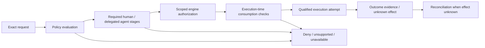

# Approval, telemetry and live operations control plane

Authority: Jeff's accepted October 7 continuation in [intent.md](intent.md). Canonical implementation, review and publication evidence: [development.md](development.md). Owner: Jeff. Root owns architecture, privacy, enforcement boundaries and release judgment.

Status: accepted product direction and proposed implementation contract. This document adds no runtime approvals, grants, policy evaluator, telemetry ingestion, live subscriptions, execution adapter or authority engine. Current `rangoon-engine` remains unavailable. The W3 editor authors inert definitions and checkpoints; its saved `validated` intent is structural inspection, not an execution approval.

## Product outcome

An operator can answer who requested an action, what exact action and resources were covered, which rules and versions applied, who could approve, who approved or denied, which authority issued a bounded authorization, where enforcement occurred and what outcome evidence exists. Each answer retains its source, time and verification state. Missing evidence and unknown effects remain visible. These are essential free-product safety and inspection surfaces; enterprise hosting adds organizational administration and scale rather than permission bypasses.

Preserve the original workbench shell: grouped navigation, stable themed header, central working surface and right inspector. Approvals gets an inbox and request timeline; Rules gets scoped configuration and change comparison; Agents gets inventory and assignments; Telemetry gets an event explorer; Command Center gets a dynamic topology and alerts; Audit gets evidence selection and exports. Distinct routes use shared records, rather than disconnected fixtures. Decorative graphics and live animation never imply authorization or readiness. Add keyboard and table equivalents to graph interactions.

## Responsibility boundary

| Concern | Rangoon responsibility | Authoritative source / limitation |
| --- | --- | --- |
| Configuration | Draft, compare and route versioned gateway/rule/assignment changes; show admission results | Selected authority must admit configurations where enforcement requires it; a locally saved draft is not active policy |
| Identity | Present verified human/workload identity and its source; separate observed labels | Authentication and workload attestation belong to qualified host/identity adapters; names and inventory rows prove nothing |
| Approval routing | Route exact requests to named human/agent stages, preserve decisions and deadlines | Authority validates approver eligibility, delegated scope and mandatory human duties before issuing authorization |
| Authorization | Request and display exact engine-issued references and limits | Rangoon cannot manufacture grants or reinterpret an approval badge as permission |
| Execution | Coordinate a qualified attempt through the declared mediated path | Trusted gateway/executor checks current scope, expiry, policy and revocation at consumption; unmanaged paths remain advisory |
| Observability | Collect minimized observations; correlate, project, search and export with provenance | Telemetry is not an authoritative receipt or proof of complete interception |
| Suspension | Submit explicit suspension/revocation changes and show acknowledgments and stale peers | Enforced suspension requires reachable qualified enforcement points; a UI toggle cannot stop unmanaged/offline work |

Never access an authority engine database directly. Keep content review, approval decisions, scoped authorizations and execution evidence separate. Multiple engines can coexist, but a request pins its selected engine and contract; no silent fallback, union of partial grants or weakest-engine bypass.

## Shared lifecycle

This is a conceptual flow, not a replacement LNSAT wire protocol. Each adapter preserves its engine's actual states and opaque evidence. Separate request, approval-stage, authorization and attempt state machines; do not compress all into a single `approved` flag. Every policy evaluation has an immutable application observation record linked to the exact input/context snapshot and its engine evidence. Approval plans, decisions and authorization observations bind that evaluation as well as the request; request identity plus a policy revision alone is insufficient. Reevaluation creates a successor evaluation, preserves history and supersedes prior approval eligibility; a new approval/authorization path must follow the selected engine’s admitted revalidation semantics. A denied or unknown evaluation cannot be overridden merely by collecting additional approvals. An expired/changed request needs reevaluation, not a silently rebound approval. Timeout or cancellation is not proof of no effect; retries after an unknown outcome require reconciliation and an explicit new attempt decision.

Evaluation succession is a bounded single-predecessor chain per request and selected engine, not latest-timestamp-wins. An initial evaluation expects no prior effective selector; a successor names the exact expected effective predecessor and superseded evaluation. Apply observed succession only when trusted-source lineage/fence and expected selector match the current projection; missing predecessors, branches, cycles or competing successors produce an explicit conflict/unknown effective state. Duplicate identical records are idempotent. The O1 contract must pin chain/resource limits before code. A decision or authorization can contribute to current eligibility only when it binds the exact effective evaluation and unchanged request/context under the selected engine’s contract; late decisions against a superseded evaluation remain historical and cannot satisfy the current plan. No automatic carry-forward occurs. Effective-selector observations do not authorize consumption: the authority/enforcer must perform its own current evaluation/freshness checks at execution time.

Required state distinctions include pending evaluation, awaiting approval, approved/denied stage, expired, escalated, revoked, suspended, authorization unavailable/refused/issued, execution check refused, attempt accepted, active, completed, failed, cancelled and outcome unknown. Engine-issued state is retained alongside its normalized display projection. Unrecognized states remain unsupported/unknown rather than default-allow.

## Scoped gateways and rules

A gateway configuration pins workspace/environment, authenticated caller classes, allowed operation classes, target/resource scopes, applicable policy revision, approval duties and enforcement adapter/version. Wildcard expansion, audience substitution and target changes are explicit configuration changes. Strict rule changes have a reviewable diff, expected prior revision, test fixtures, admission outcome, activation acknowledgment and rollback/suspension plan. Saving a rule draft cannot activate it.

Decision input binds the requesting actor, exact operation identity/digest, selected target/resources, environment, relevant capability/workflow revision and policy version. Digest computation and canonicalization must be specified per adapter and independently tested; a renderer-supplied digest is not proof of the action actually consumed. Execution checks bind the same operation and resource identity and reject substitution, replay and out-of-scope use. Policy changes between evaluation and consumption require the selected engine's revalidation semantics; Rangoon never invents a permissive compatibility exception.

Emergency suspension has its own operator authorization, reason, scope and receipt. Show requested, acknowledged, partially acknowledged and unknown coverage separately. Revocation cannot undo an already completed effect. In-flight and offline behavior must be documented and tested per executor; resource credentials and alternative write paths must not escape the promised mediation boundary.

## Human and delegated agent approvals

Approval plans support humans, agents or both, with explicit ordered or parallel stages and `all`/quorum requirements, separation of duties, designated human-only duties, absolute expiry and escalation destinations. Do not implement these modes as supported until the exact selected adapter can enforce them. Escalation changes routing within admitted scope; it does not renew expiry, drop a human stage or enlarge authority automatically.

An agent approver needs an explicitly admitted delegation from an authenticated authorized principal. Its record identifies delegator, delegate, engine/contract, permitted request classes, resources, environments, policy bounds, expiry, revocation and evidence. Agent inventory membership and model competence confer no permission. Defaults forbid self-approval, self-delegation and subdelegation; any future subdelegation must be explicitly supported and strictly narrowing. An agent cannot authorize, admit or activate any rule, gateway configuration, approval plan, authority assignment or delegation that directly or indirectly expands its own authority, extends its effective expiry or removes a required human duty. Resolve aliases and transitive delegation/assignment paths before admission; using a second agent or system identity cannot bypass this guard. Editing is limited to independently authorized inert drafts and cannot change active state; an inert expansion proposal, if supported, requires independent eligible review and authority admission. Mandatory human duties remain mandatory even when agent stages succeed.

Approval plans and approver decisions bind the exact request, immutable evaluation ID and policy revision, stage, authenticated actor, decision, reason and time. Preserve rejected or superseded decisions as history. The service verifies role/delegation eligibility again before accepting a decision; the authority verifies required decisions again before authorization/consumption. Human UI confirmation alone is not authentication, and an agent model's generated rationale is not authority evidence. Pending requests remain inspectable when an engine is unavailable, while consequential writes fail closed.

## Application contracts and adapter coverage

Freeze application records before transport. O1a now implements the inert `rangoon.ops.window.v1` observation vocabulary and bounded decoder under the [records contract](operations-records.md); O1b-1 adds bounded structural timeline/declared-graph projection and exact full-window replay under the [projection contract](operations-projection.md). Semantic evaluation/delegation/approval/outcome relationships (O1b-2), ingestion and runtime operations remain open. These application schemas are not a declared engine protocol. Initial records:

| Record | Minimum meaning |
| --- | --- |
| Actor reference | System/workspace, stable subject reference, human/agent/service kind, identity source and verification state |
| Gateway/rule revision | Immutable configuration revision, expected predecessor, bounded scopes/duties and separate admission/activation evidence |
| Request envelope | Application request/trace IDs, actor, exact operation/target references, policy and workflow revision references, selected engine and source provenance |
| Evaluation observation | Immutable application evaluation ID, exact request, initial/successor kind, one exact predecessor/superseded evaluation ID, expected effective evaluation selector and trusted-source lineage fence, canonical input/context snapshot references, canonicalization version and permitted digest, gateway/rule/evaluator artifact versions, allow/deny/unknown result, context freshness/expiry, diagnostics and original engine evidence reference |
| Approval plan / decision | Exact request, evaluation and stage, required identities/delegations, modes/deadlines, decision and supersession/revocation references |
| Delegation observation | Exact external delegation reference, scope, expiry, verification/freshness and evidence; observation is not an app-issued grant |
| Authorization reference | Opaque engine-issued identity, exact request/evaluation/required decision references, audience/operation binding and observed constraints; never a reusable generic app permission |
| Execution attempt | Request/authorization reference, attempt ID, selected executor, start/end observations, outcome and reconciliation state |
| Event envelope | Application event ID, application trace/span and causal/predecessor references, trusted producer identity plus external event selector, source sequence/time, kind, exact request/evaluation/attempt/policy references, redacted attributes and provenance |
| Projection snapshot | Immutable snapshot ID, projection/reducer schema versions, included input/workspace scope, topology/policy/coverage revisions, per-producer cursors/watermarks, source lineage and explicit missing/conflicting ranges |
| Evidence reference | Producer/engine, exact external ID and contract version, verification/freshness, bounded original artifact reference and missing reason |
| Coverage report | System/operation/target/OS, adapter/engine artifact versions, conformance evidence, freshness and operation-specific coverage |

Coverage is explicit: unavailable, advisory, partial mediation, or fully mediated for a named tested operation path. Record supported approval modes, delegation, expiry/revocation, execution-time checks, alternative write paths, outcome evidence and reconciliation independently. “Fully mediated” requires actual end-to-end enforcement tests for the advertised path and current artifact versions; it is not a global safety/compliance claim. Unknown or stale coverage prevents a governed execution offer. Advisory systems may supply observations, but cannot inherit the badge or permission of a different qualified route.

LNSAT is one independent authority adapter. Other policy/authority systems require their own closed typed mapping and conformance tests. A policy evaluator that produces an allow decision may still lack authorization consumption, replay protection or execution mediation; show those gaps. Discovery and read access cannot enable writes. An adapter upgrade or operation change invalidates previous coverage until requalified.

## Telemetry and privacy

Capture request creation, evaluation decisions, approval routing/decisions, authorization observations, execution checks/attempts, outcomes, resource-access metadata and failures. Correlate each with application trace/request/attempt IDs and exact policy revisions; preserve engine IDs separately rather than replacing them. Support multiple evaluations and attempts within one trace. Record latency with source and measurement method; distinguish estimated, observed and finalized costs with currency/units. Missing cost or latency is unknown, never zero. Rangoon mints opaque application request, trace, span, evaluation and event IDs at a trusted ingress boundary; renderer/external correlation tokens cannot select or replace these identities. External tokens are separately typed, strictly bounded and allowlisted/redacted or rejected before persistence, indexing, display or export. They cannot establish ownership, trust or cross-workspace joins. Minted IDs provide correlation only, not authorization or proof of authenticity.

Default payload excludes prompts, full source, tool arguments, credentials, private resource contents, raw URLs/paths and approval free text. Use closed allowlists, class-aware redaction before local persistence or remote transfer, bounded fields, safe error codes and opaque resource references. Redaction failure refuses ingestion/export rather than falling back to raw logs. Digests of low-entropy sensitive data may expose information; hashing is not universal anonymization. Secrets must never be retained for replay. Optional richer evidence needs explicit purpose, access/retention policy, owner consent and adapter qualification.

Separate source observation time, receipt time, source sequence and monotonic local ordering. Deduplicate by trusted producer/event identity with conflict detection; do not collapse distinct attempts sharing a request ID. Late, missing, reordered and conflicting events produce visible gaps. A disconnected stream, dropped events or stale snapshot must not look idle or healthy. Search, export and subscriptions apply the same workspace/tenant/read scope as direct evidence access. Bound queues, retention, query pages, graph fan-out and payload size; slow clients must not block enforcement. Audit exports include coverage, redaction and missing-event/verification metadata rather than claiming completeness automatically.

Local-first collection, retention/deletion, disk-full and crash handling need their own repository contract. Existing SQLite workspace is plaintext and has no authenticated telemetry log. Do not label an event chain tamperproof because it has hashes. Signed/checkpointed evidence or external anchoring requires an explicit key/threat/recovery design, including detection of truncation, replacement and rollback. Cloud ingress, authentication, tenancy, encrypted storage, retention and live subscription transport remain separate later stages.

## Live graph, timelines and historical replay

Project nodes for agents, workflows/revisions, tools, resources, gateways, approval stages/approvers and authority engines. Edges represent request flow, declared dependency, delegated authority observation, control mediation or evidence lineage; their legend and inspector distinguish declared topology from observed activity and verified enforcement. An animation cannot indicate an actual grant.

Show pending approvals, blocked/refused actions, active attempts, failures and unknown outcomes with text and shapes as well as color. Filters include workspace, system, engine, policy revision, actor, resource class, coverage, trace, attempt, time and outcome. Drill-down opens the exact bounded records and evidence. Compare policy/topology snapshots across time. Historical replay uses captured topology/policy versions and marks unavailable snapshots; it neither reevaluates old requests under current policy nor executes anything. Never infer an absent event proves no action happened.

Use a versioned immutable projection snapshot plus bounded incremental events. The snapshot pins its ID, reducer/projection versions, included scope, topology/policy/coverage revisions and each producer’s cursor/watermark and lineage fence. A subscription starts at that exact fence; retain event predecessor/causal lineage and require compatible reducer versions rather than mixing an old snapshot with arbitrary latest events. The reducer is deterministic; live and replay projections use the same pure rules. Out-of-order/late events are applied only under a specified bounded ordering rule or require rebuilding a successor snapshot. Exact duplicate events are idempotent; same producer/event identity with different content produces an explicit conflict. Missing predecessors, cursor jumps, unavailable snapshots and conflicting events produce deterministic incomplete/conflicted projection states; they cannot erase unknown effects or show a complete healthy trace. Keep layout/selection filters as UI state. Keyboard-accessible inbox, tables and timeline convey all critical graph states. Reduced motion disables pulses/automatic movement; screen-reader summaries and focus remain stable while events arrive.

## Operations console

| Surface | Operator outcome | Required honest states |
| --- | --- | --- |
| Approval inbox | View scoped queue, exact action, required stages and eligible approvers; submit decision | Read-only/unavailable, identity unverified, delegation missing, expired, stale policy, denied or superseded |
| Rule editor | Compare immutable drafts, run fixtures, submit admission and activation | Draft is inactive; conflict/refusal; activation unknown or partial |
| Agent inventory / assignments | Inspect actual identity, declared capabilities, delegated scope and mediation coverage | Declared versus observed versus verified; unmanaged or stale systems |
| Telemetry explorer | Filter traces and attempts; view timings/costs/access/failures and missing steps | Estimated/unknown, redacted, delayed, dropped, duplicate/conflicting evidence |
| Live Command Center | Find pending gates, blocked paths, active attempts and unknown effects | Freshness and coverage visible; no fabricated totals/compliance percentage |
| Alerts / emergency controls | Triage expiry/escalation/failures/gaps; request scoped suspension | Requested versus acknowledged; uncovered executors cannot be labeled suspended |
| Audit exports | Export scoped redacted records and original evidence references | Integrity/verification and coverage limits, excluded/missing records, retention window |

## Build sequence and acceptance

1. **O1: inert shared records and projection core.** Closed versioned DTOs, bounded IDs/attributes, request/approval/attempt state separation, explicit coverage and provenance. Implement a deterministic event projector and replay with adversarial synthetic fixtures. No grant issuing, policy evaluation, network, credentials, database or execution. Pin resource bounds, immutable evaluation/decision linkage, generated-versus-external IDs, snapshot fences and relationship validation in a dedicated implementation contract before code. Negative fixtures cover duplicate, conflicting, late and out-of-order events; missing predecessors and scope/version mismatch cannot yield a complete projection. Include competing old/new evaluation successors, a late old-evaluation approval/authorization and a changed effective selector during approval: none can restore eligibility or satisfy the new plan.
2. **O2: actual local operations views.** Approval inbox, agent/assignment list, telemetry explorer and graph/timeline over the O1 repository/service; empty/unavailable states until real collection exists. Pointer/keyboard/filter/replay parity and original screenshot shell. Synthetic demonstration remains separate from actual runtime observations.
3. **O3: bounded read-only ingestion.** Qualified identity/read adapters, minimized native observations, persistent event/recovery/retention contract, gap/backpressure handling, audit export and security review. Source events and engine evidence keep separate verification states. No authority write becomes enabled by read access.
4. **O4: one qualified approval/enforcement path.** Exact configured gateway and admitted rules, authenticated human approval, then explicitly delegated agent stages where supported, scoped engine authorization, execution-time consumption and disposable execution/evidence/reconciliation. Test direct and transitive self-escalation through gateways, rules, assignments, approval plans and delegation aliases; requester self-approval; mandatory human omission; changed evaluation/context with unchanged request; quorum/replay/digest substitution; policy drift; expiry/revoke/suspend; offline peers; and crashes before/after effect. No automatic engine fallback or unknown-effect retry.
5. **O5: cross-system adapters and live hosted operations.** Publish per-operation coverage and versioned conformance suites; prove workspace/tenant subscription, query, export and worker isolation, throughput/retention/recovery, redaction and cost accounting. Hosting and initial all-three-desktop release retain their own qualification gates.

Root owns O1 semantics/privacy and integration; bounded workers may implement exact pure files after accepted contract and fresh review. Fresh independent source and UI/a11y review and named tests are mandatory. Existing W3 source publication does not qualify O1–O5. Initial three-OS release scope must identify which O stages have passed; staging does not silently remove these core surfaces from the accepted product. Execution-dependent gates cannot pass while required authority/runtime adapters remain unavailable.

The original O0 eight-file architecture packet owned only README, intent, this contract, application architecture, product experience, plan, continuation and development ledger. Run artifact/reference and whitespace validation and fresh independent architecture/claim review. No production source, schema, CI, native configuration, live endpoint, credentials, private telemetry, engine activation, license, installer/release, deployment or government submission is changed. Reversion removes the documentation proposal; it does not revoke an external grant because none is issued.
