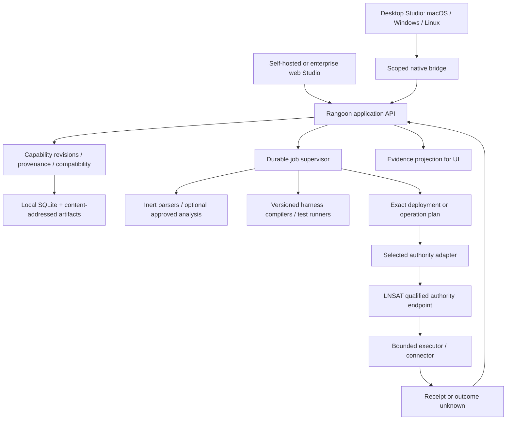

<!-- intent-driven-delivery:plan:v1 -->
# Plan: Rangoon from capability workbench to governed platform

Status: proposed
Authority: [Accepted research and prototype intent](intent.md); this plan is a recommendation for Jeff's review, not implementation or release acceptance
Owner: Jeff
Last updated: 2026-10-04

## Scope and protected lanes

**Build a useful, free, open-source capability workbench first, with macOS, Windows, and Linux in the same initial desktop release.** Make existing agent projects understandable, reusable, portable, and reviewable. Add trustworthy execution only where a tested authority path can mediate the actual consequence. Evolve that same product into an owner-hosted team service and eventually a managed enterprise platform.

The first customer is a developer or small platform team with fragmented `AGENTS.md`, `CLAUDE.md`, `SKILL.md`, rules, tools, hooks, and project context across several repositories. Their first outcome should be: "I know what my agent is configured to do, where those instructions came from, which targets preserve them, and exactly what will change before I export or deploy." This remains valuable before autonomous operations are available.

The long-term purpose is a portable, inspectable lifecycle for AI capability: a supply chain for instructions, skills, workflows, permissions, tests, and evidence. The differentiator must be demonstrable semantic preservation and consequence control, not another model chat interface or a large integration-logo catalog. The preview is a product discussion tool; it is not evidence that this architecture exists.

### Product boundaries

| Layer | Owns | Does not establish |
| --- | --- | --- |
| Rangoon Studio | Discovery, structured assets, provenance, editing, decomposition, composition, test plans, compatibility, compilation, review | Authority to act because content says an action is allowed |
| Rangoon application services | Workspaces, immutable revisions, jobs, adapters, deployment plans, operation and evidence views | A replacement implementation of LNSAT authority semantics |
| LNSAT | Independent reference authority and evidence engine; exact contracts as qualified by its release | A released Rangoon backend, cross-platform installer, or general agent loop |
| Harness/runtime | Model loop and tool selection within its own capabilities | Guaranteed enforcement when it can bypass the managed path |
| Connector/executor | Bounded external operation and evidence collection | Permission merely through credentials or network access |
| Enterprise control service | Collaboration, tenancy, identity integration, fleet coordination, retention and operations | Privileged exemption from core security or entitlement-as-authority |

Imported files are untrusted data. Scripts, hooks, package installation, macros, and arbitrary commands do not run during discovery. No real provider, deployment, production, or government-application operation is opened by this plan.

### A concrete first workflow

1. Open a local project using an explicit folder selection. A bounded scanner inventories instruction files without following links outside the allowed root or executing their contents.
2. Review source spans and unsupported files. Deterministic parsers run first. Optional local or approved cloud analysis proposes modules; it does not silently upload the project.
3. Accept a skill proposal with its original bytes, content digest, source revision, line/byte spans, extracted constraints, and review history. Unassigned source stays visible.
4. Split an overgrown deployment instruction into test, build, and release capabilities. A coverage ledger shows kept, moved, duplicated, and unresolved fragments. Merge two review capabilities with explicit policy and dependency conflict handling.
5. Compose a coding-agent bundle. Pick a pinned target adapter. See which concepts survive, require adaptation, or cannot be represented. A safety-sensitive loss blocks the output; no silent omission.
6. Run static tests and fixture simulations. Real harness tests require a separate configured test executor and explicit limits. Keep the three evidence classes distinct.
7. Export the exact reviewed target files and lock manifest to a new directory. Before later activation, inspect the diff and target configuration drift. Compilation does not install or activate.
8. For a qualified managed action, bind the exact request to the selected authority provider, record its decision, consume authorization through the trusted path, and show the resulting receipt or unresolved outcome. If the harness retains an unmanaged write path, label that route advisory/unmanaged.

## Files and ownership

Current packet is intentionally a small dependency-free preview, separate from the proposed product stack. Root owns this document, evidence, grant research, source/reference registers, asset provenance, integration, validation, and review judgment. Native Terra owns `preview/index.html`, `preview/app.css`, `preview/app.mjs`, `preview/model.mjs`, `tests/preview.test.mjs`, `package.json`, and `scripts/serve.mjs` for the initial implementation; ownership then returned to Sol for a substantial UI rewrite, server confinement, and integration fixes. One writer per file. Independent reviewers remain read-only.

Proposed production modules, after acceptance:

```text
apps/studio/                 React + TypeScript UI shared by desktop and web
apps/desktop/                Tauri shell; scoped native bridge only
apps/server/                 Rust API/service composition and job supervisor
crates/rangoon-domain/       capability revisions, provenance, compatibility
crates/rangoon-store/        SQLite repository implementation, migrations
crates/rangoon-import/       bounded inert discovery and parser isolation
crates/rangoon-jobs/         durable jobs, leases, cancellations, recovery
packages/contracts/         generated TS types and versioned schemas
packages/adapter-kit/       importer/compiler/runner conformance fixtures
adapters/harnesses/          independently versioned format adapters
adapters/authority/lnsat/    published LNSAT contract binding, not a fork
adapters/connectors/         explicit operations and reconciliation
fixtures/                   secret-free source corpus and hostile inputs
docs/                       decisions, support matrix, evidence, runbooks
```

These paths and technology choices are proposals. They are not package availability claims or permission to scaffold the full tree now. Do not copy the LNSAT implementation into Rangoon. Reference its qualified interfaces and test corpus with pinned versions and license notices.

### Architecture recommendation

Use a modular monolith initially: React/TypeScript for interaction; Rust for the app service, import boundaries, native bridge, and durable local state; Tauri for desktop delivery. The browser UI talks to application contracts, not directly to the filesystem or privileged executors. This aligns with the existing Rust/TypeScript skills and LNSAT boundary while avoiding a distributed system before it is needed. [Tauri's official overview](https://v2.tauri.app/start/) confirms shared web frontends with a Rust-capable native layer and system WebViews; its platform support does not establish Rangoon support.

Tauri is a candidate, not a free security boundary. A prototype qualification spike must test WebView rendering, accessibility, filesystem permission scope, IPC validation, process lifecycle, signing, and update behavior on every selected OS. Choose Electron only if measured WebView incompatibility or required native functionality justifies its additional runtime cost. Do not maintain two desktop shells.



**Two planes, one explicit boundary.** Management remains available when execution is unavailable. Credentialed actions must cross the selected authority and enforcement path; a UI "allow" field cannot unlock a tool. A model route, catalog install, test pass, or subscription entitlement cannot unlock it either.

### Canonical data model

Use relational metadata plus content-addressed blobs, not a graph database in v0. A typed edge table supports the graph view. The graph is a view of records, not a second source of truth.

| Record | Essential identity and rules |
| --- | --- |
| Workspace / project | Stable ID, owner, root binding, data/egress policy; server tenancy applied from authenticated context |
| Source snapshot | Source URI, revision if known, original-byte digest, observed time, scanner version, file limits; local paths redacted in exports |
| Asset / revision | Stable asset ID plus immutable revision digest; kind, schema, normalized content, retained raw source, author and review state |
| Provenance edge | Source digest and exact span, derivation/merge/split relation, tool/model version if used, accepted/rejected proposal and reviewer |
| Capability requirement | Data class, operation, environment, constraint, approval duty; never an executable grant |
| Adapter / support result | Publisher, artifact digest, semantic version, contract range, target version, OS/architecture, tested capability subset and evidence |
| Bundle / lock | Exact asset revisions, inherited constraints, adapter versions, target, transform report, tests, digest; reproducible immutable build input |
| Job / attempt | State, stable operation key, input digest, bounded lease, cancellation, result references; duplicate delivery never implies duplicate effect |
| Deployment / assignment | Plan digest, explicit target, previous and desired revision, drift check, acceptance, activation and rollback record |
| Authority reference | Provider identity/version, request/decision/consumption/receipt IDs and digests; original evidence retained with verification result |
| Evidence / observation | Source, observed time, freshness, integrity/verification state, missing reason; telemetry never relabeled as an authoritative receipt |

Define canonical serialization before signing or hashing normalized records. Preserve raw-byte hashes separately from semantic hashes. Do not use incidental JSON key ordering as a security contract. Inherited prohibitions accumulate; an override that weakens one becomes a visible policy-change proposal rather than an automatic resolution.

Local first: SQLite with migrations and content-addressed files, transactional metadata changes, background jobs persisted before work, and an outbox for event delivery. Recovery tests cover abrupt process death, disk full, corrupt/missing blob, partial migration, and replay. The local store and LNSAT's store remain separate; never write the engine database from the UI or Rangoon ORM.

### Services, APIs, and state

Specify typed operation contracts before choosing route names. Minimum groups: source inventory, analysis proposals, revisions/lineage, graph changes, compiler results, tests, deployment plans, authority requests, and evidence queries. Mutations require expected revision and operation ID. List APIs need bounded pages; job progress needs explicit denominators or indeterminate state. An event stream is a projection that can reconnect from a cursor; it is not the durable job log.

Do not claim exactly-once distributed execution. Persist an operation claim and exact request before consequence, use provider idempotency only where its semantics are verified, and reconcile uncertain effects. A failed response can mean the external effect succeeded. `outcome_unknown` blocks automatic retries and incompatible new work. Cancellation acknowledges a request to stop; it is not proof that an action never happened. Remote pause/revocation cannot be promised to stop already-running disconnected work; define lease expiry and bounded scope.

Keep asset lifecycle, compatibility, test status, deployment state, and execution outcome as separate dimensions. Published does not mean tested; tested does not mean compatible everywhere; deployed does not mean authorized; a request awaiting approval is not an outcome-unknown action.

### Trust, privacy, and extensions

The local bridge is a narrow IPC surface: selected folders, bounded reads/writes, approved output directories, and registered executables only. Do not expose a generic shell or raw file API. Local network services require binding/peer/origin controls and authentication; numeric loopback alone does not authenticate a caller. Use native secret stores where available and require an explicit fallback when Linux secret storage is unavailable. Key material stays outside assets, model prompts, logs, and exports.

Imported Markdown renders with a restricted sanitizer, no active HTML, and no automatic remote image/link fetch. Archives require traversal, symlink, decompression ratio, nesting, file count, and byte limits. Scanning must distinguish exclusions and unreadable files from an empty project. Prompt-injection content remains data; analysis outputs must validate against a schema and cannot call tools. Remote analysis requires a visible payload preview, data policy, selected provider, retention disclosure, cost cap, and permission. Local-only operation remains useful with deterministic parsers and manual edits.

Start extensions with declarative manifests and out-of-process workers. Do not load arbitrary third-party code inside the desktop UI, server, or authority process. A manifest declares publisher, version/digest, contract range, operation set, inputs/outputs, data classes, egress, credentials by reference, side effects, limits, idempotency, receipt/reconciliation behavior, license, and upgrade/revocation policy. Native third-party executors need a qualified OS-specific containment boundary; a subprocess is not a sandbox. WASI can be investigated for pure transforms after compatibility tests. UI extensions start with schema-rendered panels; remote executable UI is deferred.

Six extension families stay distinct: importers, harness compilers, analysis providers, test/execution runners, business connectors, and authority adapters. A seventh deployment adapter deals with exact installation/activation plans. An inference provider is not a harness; a policy evaluator is not an authority provider. Another authority provider must prove scope/digest binding, expiry, replay behavior, consumption, unknown outcomes, evidence, and reconciliation. If it cannot, it is advisory and cannot drive governed writes. No silent fallback between authorities.

## Sequence

### Release scope and support matrix

Jeff selected **all three desktop OSs first**. That means one initial desktop product release with the same management workflow, not an unsupported claim of identical host enforcement.

| First-release target | Proposed artifact | Required qualification |
| --- | --- | --- |
| macOS, Apple silicon | Signed/notarized app and DMG | Native WebView, Keychain, folder grants, clean install/update/uninstall, crash and migration recovery |
| Windows 11, x64 | Signed installer | WebView2 dependency, Credential Manager, long/Unicode/case paths, reparse points, Defender behavior, update and rollback |
| Linux, x64 Ubuntu LTS baseline | AppImage and/or deb; choose one primary | WebKitGTK/system dependency matrix, secret-service absence, Wayland/X11, permissions, package install and recovery |
| Linux owner-hosted web/CLI | Versioned binary/service recipe after service qualification | Auth/TLS, service account, durable storage, backup/restore, upgrade, browser support, no exposed raw executor |

Exact minimum OS versions and packaging choices freeze in R1 after clean-machine evidence. Intel macOS, Windows ARM64, Linux ARM64, Fedora/RHEL derivatives, additional package formats, Homebrew/winget, and offline signed installers enter subsequent matrix rows. No row inherits support from CPU architecture or framework marketing. A buildable artifact is not a supported row.

On macOS and Windows, initial management, inert import, review, static testing, and deterministic export can work without a governed native executor. The UI must say which action paths are unavailable. A reviewed Linux authority endpoint can later serve a desktop client; that requires a real remote identity, transport, authorization, and target contract. Do not route an unsafe operation through SSH or a Docker socket merely to claim parity. WSL2 is a distinct future support row. Mobile begins as responsive inspection/approval companion only after server identity and human-approval contracts; edge execution remains a separate research lane.

### Ordered build packets

Each row is a proposed reviewable PR scope, with dependencies and measurable exit evidence. No elapsed-time completion percentage is substituted for acceptance.

| Packet | User result / exact scope | Depends on | Exit evidence |
| --- | --- | --- | --- |
| R0 | This vision, source/claim audit, nine-view prototype, dark/light direction | Current request | Named tests, review, explicit fixture labels, human visual/architecture review |
| R1 | Choose license; freeze contracts and Tauri spike on macOS/Windows/Linux | R0 review | Reproducible build and clean-machine shell launch on each OS, accessibility/IPC spike, architecture ADR; no engine-support inference |
| R2 | Persistent local workspace and safe import | R1 | Bounded hostile-input corpus; zero imported execution/network; permission errors, link escapes, long paths, disk-full and crash recovery verified on all OSs |
| R3 | Capability IR, editor, Decompose, Merge/Split, lineage | R2 | Original snapshots immutable; every retained source span accounted for; policy weakening blocked; undo/version history and provenance tests |
| R4 | Two real format adapters: Codex-style AGENTS.md and Claude-style instructions/skills; third Gemini target after evidence | R3 | Pinned target versions, golden outputs, round-trip/change report, unsupported fields visible; all three OSs compile identical normalized fixtures |
| R5 | Static test lab, fixture simulation, reviewed bundle/export | R4 | Deterministic bundle digests, meaningful negative tests, export diff, target-drift protection; no install or execution implied |
| M1 | Local and cloud model assistance, optional to use but both required for V1; pure M1a packing and proposal validation implemented under [model-context-core.md](model-context-core.md), with evidence in the development ledger | R2/R3 saved identities; independent advisory port | Remaining M1b–M1e: qualified transport and secret custody, explicit exact-payload selection, native proposal inspection/application, measured token/quality evidence, all-three-OS GUI; no model authority |
| R6 | Free desktop alpha release on all three OSs | R1–R5, M1 | Signing/update/rollback, backup/restore, docs, SBOM/dependency/license review, real fresh-host installs; product release owner accepts support rows |
| R7 | One end-to-end governed disposable Git operation through LNSAT | R5 and LNSAT accepted runtime/release prerequisites | Exact request/approval/consumption/adapter/receipt chain; replay, changed digest, revoke/expiry, crash-before/after effect, unknown-outcome reconciliation; no public/prod writes |
| R8 | Linux single-node self-hosted team service | R6 and server auth/storage qualification | Workspace isolation, role checks, concurrency, job recovery, backup restore and upgrade, API compatibility, bounded remote worker identity; R7 required for governed writes |
| R9 | Open extension SDK and small community registry | R4–R8 as relevant | Third-party reference adapter passes conformance; signed provenance/update rollback; disabled/revoked version behavior; no arbitrary in-process plugin execution |
| R10 | Enterprise private-cloud / single-tenant managed pilot | R8–R9 and real user demand | SSO/SCIM choice, organization roles/separation of duties, customer keys/retention, data residency, audit exports, support process, measured recovery/load budgets |
| R11 | Multi-tenant hosted service and hybrid fleet | R10 isolation/threat-model evidence | Cross-tenant negative tests, quotas/abuse controls, regional failover/restore, secure outbound worker identity, lease/revocation behavior, metering separate from authority |
| R12 | Specialized verticals, mobile/edge, new authorities and standards | Qualified contracts and demonstrated use case | Per-platform/adapter conformance plus an actual operator purpose; no blanket autonomous-agent or hardware support promise |

R2–R6 can deliver useful open-source software while LNSAT completes its own gates. R7 cannot be accelerated by redefining missing engine proof as a Rangoon feature. The first governed demonstration uses disposable fixtures and explicit failure injection, not a production deployment.

### Cloud evolution without a rewrite

Keep the domain/service API independent of desktop IPC. In local mode the shell starts an owner-controlled application service; in server mode the same domain is composed behind an authenticated service endpoint. Isolate filesystem import behind a source adapter: remote web cannot arbitrarily browse a user's disk. Remote operations run on scoped workers in the target trust zone, not inside the public web process.

Begin with a single writer and SQLite locally. Introduce a PostgreSQL repository implementation when multi-user concurrency warrants it, with the same contract suite and explicit migration/export tests. Use object storage for artifacts only when required; content identity must not depend on an object-store key. A lease-based durable job queue and transactional outbox precede distributed workers. Avoid distributed active-active writes and CRDT capability merges in the first team release; use expected-revision conflicts and explicit review.

For hosted enterprise, define tenant isolation at authentication, queries, object names, jobs, workers, caches, logs, and exports. A desktop cache is not automatically synchronized. Sync immutable revisions and conflict records; remote access does not transfer local execution permission. Local workers initiate authenticated outbound sessions with bounded leases. Offline authoring works; offline execution is denied unless an explicit bounded offline authority design has separately passed review. Encrypt transport and backups; prove restore and retention/deletion, not just backup creation.

### Open source and business model

Recommendation for acceptance: Apache-2.0 for the Rangoon community app and public adapter/contracts, consistent with the inspectable LNSAT core. This recommendation is **not a license grant**. The current app repository lacks an adopted license; select one, establish contributor/DCO policy and third-party notices before advertising a downloadable open-source app.

Free community scope should include all three desktop apps, local workspaces, core import/decompose/merge/split, skills/workflows, static tests, deterministic compile/export, basic self-hosting, reference adapters, essential security controls, evidence verification/export, and no mandatory cloud account. Model inference or third-party services may cost money when selected; free software does not mean unlimited free inference. Keep deterministic/manual operation usable without paid inference.

Enterprise value should come from managed hosting, organizational administration, SSO/lifecycle provisioning, collaboration, fleet operations, advanced retention/export, private registries, regulated deployment assistance, supported connector packs, SLAs, and incident support. Never make basic safety, local evidence access, or vulnerability fixes a paid-only feature. Entitlement affects product convenience, never whether an unauthorized operation is allowed.

Earlier LNSAT ADR-0003 allowed commercial visual management. Jeff's present instruction makes the initial Rangoon app free/open source. Reconcile this in a reviewed follow-up ADR; do not silently rewrite old upstream acceptance or presume every future enterprise module is open or closed. LNSAT remains independently useful; Rangoon can offer composition without an engine connection.

### Expansion and standards

Keep an interoperability registry with exact standard/version, implementation version, supported subset, tests, license, deprecation date, and evidence URL. Only promote a target to supported after conformance. Standards and products have distinct roles:

| Interface | Proposed purpose / adoption point | Boundary and evidence |
| --- | --- | --- |
| Agent Skills + harness instruction formats | R2–R4 import/export | Preserve source extensions; unknown constructs remain visible. [Agent Skills specification](https://agentskills.io/specification) |
| MCP | Tool/resource discovery and bounded client/server adapters | Pin a released revision (2026-07-28 inspected). Transport authorization is not action authorization; STDIO and HTTP have different security contexts. [MCP authorization](https://modelcontextprotocol.io/specification/2026-07-28/basic/authorization) |
| A2A | Later remote agent task interoperability | Negotiate explicit version/capabilities; task identity/cancellation does not replace authority. Do not track a moving dev URL as a support pin. [A2A specification](https://a2a-protocol.org/latest/specification/) |
| OIDC / OAuth / SPIFFE | Human identity, delegated resource access, workload identity | Separate subjects, audience, expiry and scope; none grants consequence by itself. [SPIFFE overview](https://spiffe.io/docs/latest/spiffe-about/overview/) |
| OPA / Cedar / OpenFGA | Policy/relationship input adapters when demanded | Products, not interchangeable authority standards. Preserve unknown/deny behavior and exact evaluation context. [OPA](https://www.openpolicyagent.org/docs), [Cedar](https://docs.cedarpolicy.com/) |
| OpenTelemetry / CloudEvents | Correlated observations and exports | Minimize data; no prompt/tool-argument bodies by default. Pin GenAI conventions independently; the former docs page has moved. [OpenTelemetry notice](https://opentelemetry.io/docs/specs/semconv/gen-ai/) |
| OpenAPI / JSON Schema | App and connector operation descriptions | Validate schema dialect and size limits; do not infer safe execution from a schema |
| OCI / SBOM / signing / SLSA-style provenance | Later release and artifact verification | Standards adoption and verified levels need real artifacts and evidence; no certification by naming them |
| NIST AI RMF and accessibility standards | Evaluation/control mapping | Map controls to evidence and gaps; do not imply certification, FedRAMP, ATO, or government endorsement. [NIST AI RMF](https://www.nist.gov/itl/ai-risk-management-framework) |

Provider/model routing keeps company origin, hosting region, processing region, model provenance, retention, training terms, subprocessors, and configured endpoint separate. A U.S. company alone does not prove domestic processing or authorize data transfer. Missing facts remain unknown. Select model versions and capability ranges per task; no silent provider fallback. Specialized robotics, industrial, financial, or healthcare adapters require domain safety review beyond this generic platform plan.

## Validators

Current preview: `npm test`, `node --check preview/app.mjs`, `node --check preview/model.mjs`, `git diff --check`, intent/plan schema validators, local server HTTP/path tests, and rendered inspection if permitted. Test at desktop 1440/1680, tablet 1024/768, narrow 390 and 320; dark/light; standard/dense/focus; keyboard; reduced motion; empty/partial/blocked/unknown scenarios. Record unrun checks rather than inferring a pass.

Production packet gates are the table above. Proposed quantitative research targets, not achieved results: zero silent safety-critical constraint drops across a curated versioned compiler corpus; every derived module links to source or an explicitly authored addition; all designated replay/digest-substitution cases denied; unknown external effects never automatically retried; clean-machine qualification of every advertised platform row. Measure p50/p95 parsing/compile and memory on stated fixture sizes before setting public performance promises. Track time-to-first-useful-export, correction rate, unsupported-field rate, and operator comprehension with a real pilot baseline.

## Independent review

Use a fresh native reviewer for architecture/claim correctness and a different-provider review of only secret-free synthetic UI evidence where allowed. Reviewers receive this intent, exact files, constraints, and named validation receipts. UI review covers behavior, keyboard, contrast, responsive layout, visual hierarchy and honest states. Primary controller resolves findings and owns validation; independent PASS is not merge, release, or grant authority.

## Rollback and recovery

The current preview has no product database or external action. Stop its local server to remove runtime effects; only theme preference may persist in the browser. Keep original image references unchanged. Changes exist in an isolated app checkout and can be reviewed or discarded there without modifying the marketing site or LNSAT. Production rollback must distinguish UI/app rollback, schema compatibility, activation rollback, and irreversible external effects; an old binary cannot blindly reopen a migrated store or undo an already-completed connector operation.

## Deviations

- Jeff rejected the initial suggested macOS/Linux-first sequence and explicitly selected all three desktop OSs first. The plan now gates the initial desktop release on all three.
- Existing checkout is the marketing site. An isolated clone of the actual application repository prevents website source/history from entering the app review.
- A bold graph-oriented dark design supersedes literal light screenshot parity. Original page functions and orange mascot remain; generated statistics/testimonials are removed.
- The initial packet implements a static interactive prototype, not the proposed production stack. Production architecture remains reviewable before code investment.

## Evidence ledger

Use [validation.md](validation.md) for current command results and review findings, [claims-and-evidence.md](claims-and-evidence.md) for LNSAT maturity, [sources-and-features.md](sources-and-features.md) for recovered intent, and [government-funding.md](government-funding.md) for funding preparation. These support this plan; only [intent.md](intent.md) records current task acceptance. Source/architecture audit coverage is targeted, not a line-by-line security audit or proof of complete historical retrieval.

### M1c credential custody implementation boundary

The first cloud slice implements explicit native credential inspect/add/replace/remove under [model-cloud-custody.md](model-cloud-custody.md). It uses OS-specific stores and an isolated new-key input window with final native consent, while preserving an unavailable cloud transport. Next gates are all-three-OS custody/GUI qualification and the fixed-origin cloud request adapter with exact credential-revision/payload consent binding. Secret custody is not SQLite encryption, source-transfer authorization or security certification. See the canonical [development ledger](development.md) for current evidence rather than treating dependency availability as runtime support.
