# Rangoon preview gallery

Rendered from the local interactive prototype on October 4, 2026. All records are synthetic. These are actual browser captures, separate from the [generated concept image](../preview/assets/dark-command-concept.png). Use `npm start` at the repository root to explore the interactions and theme toggle. The app is not a released desktop build.

## Command Center · dark

## Import & Analyze · dark

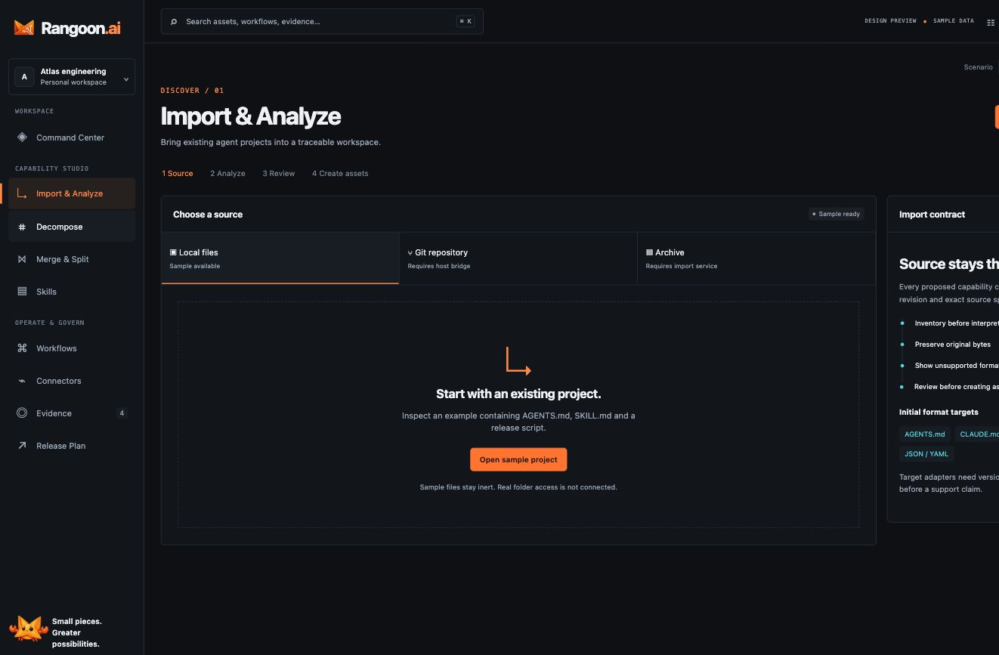

## Decompose · dark

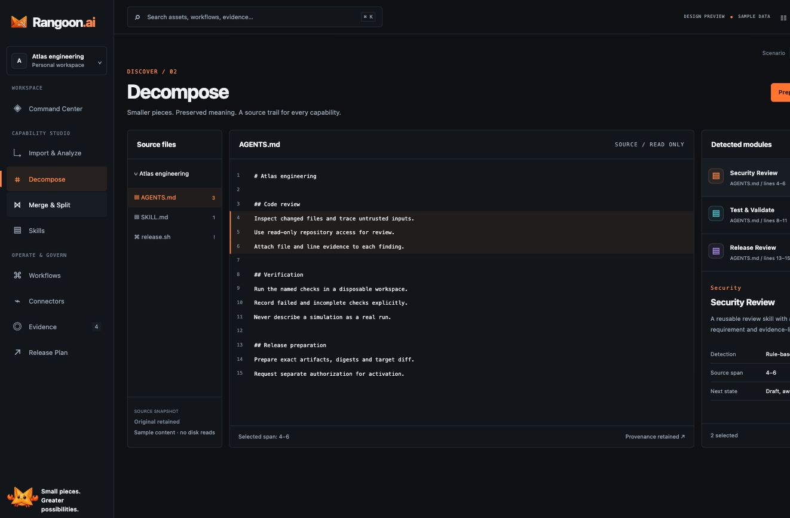

## Merge & Split · dark

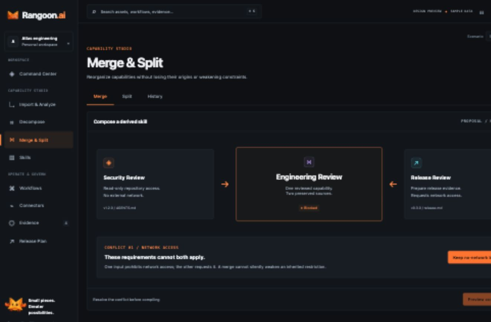

## Skills · dark

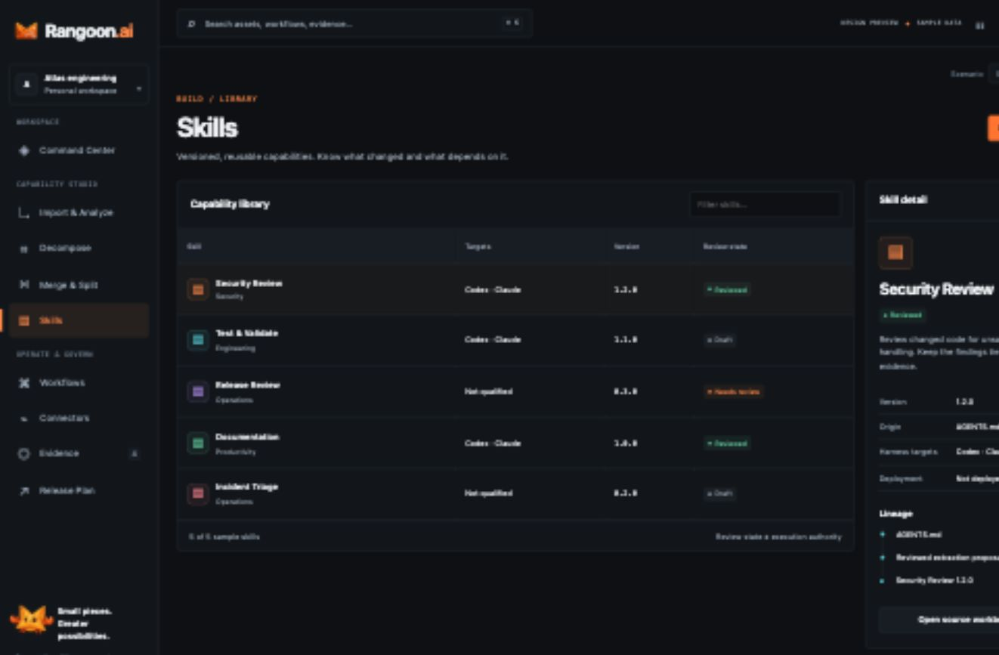

## Workflows · dark

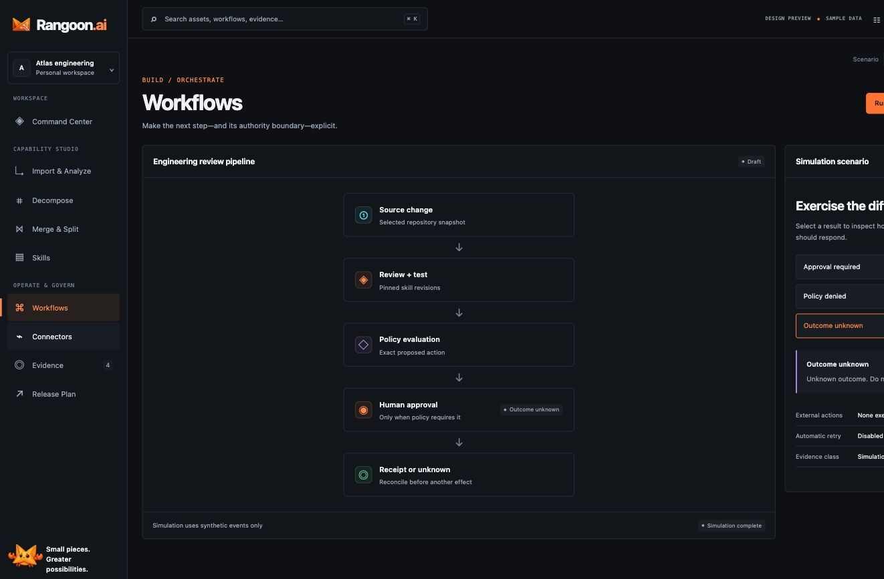

## Connectors · dark

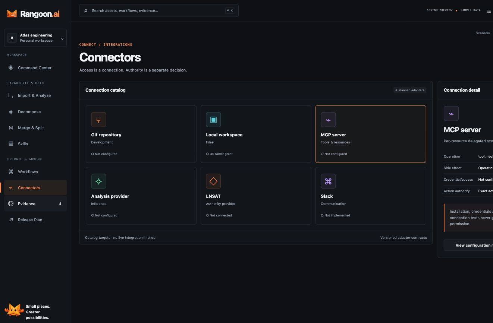

## Evidence · dark

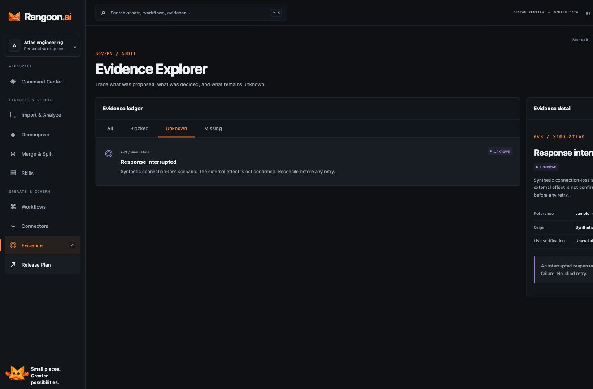

## Three-desktop release plan · dark

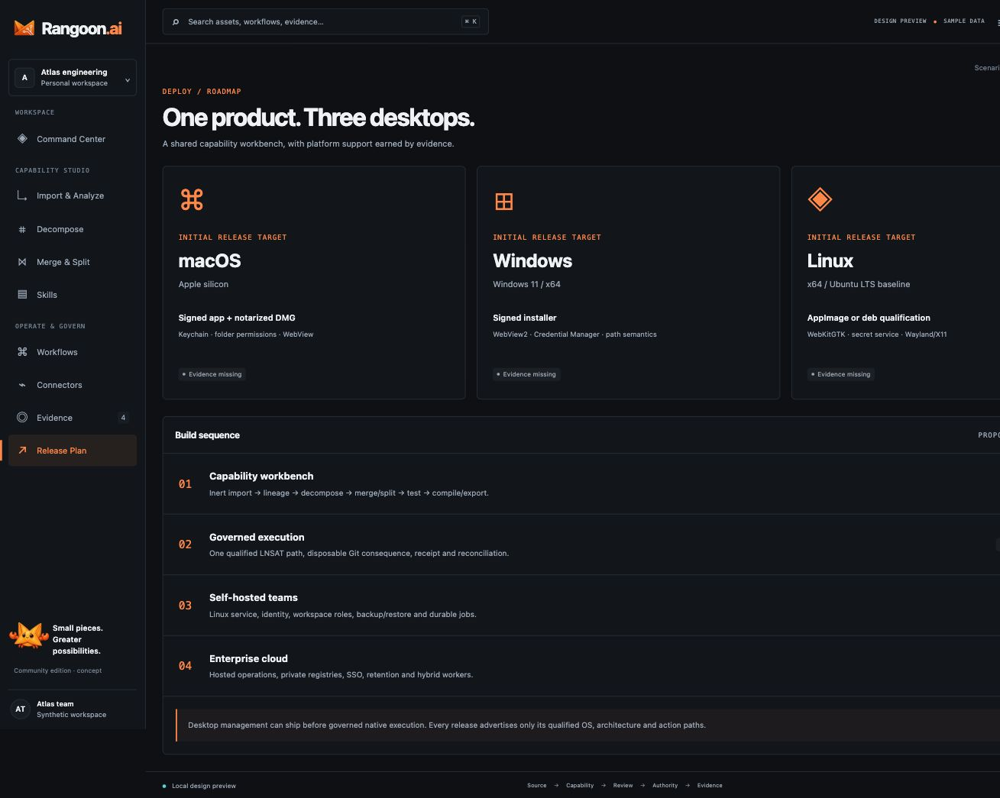

## Command Center · light

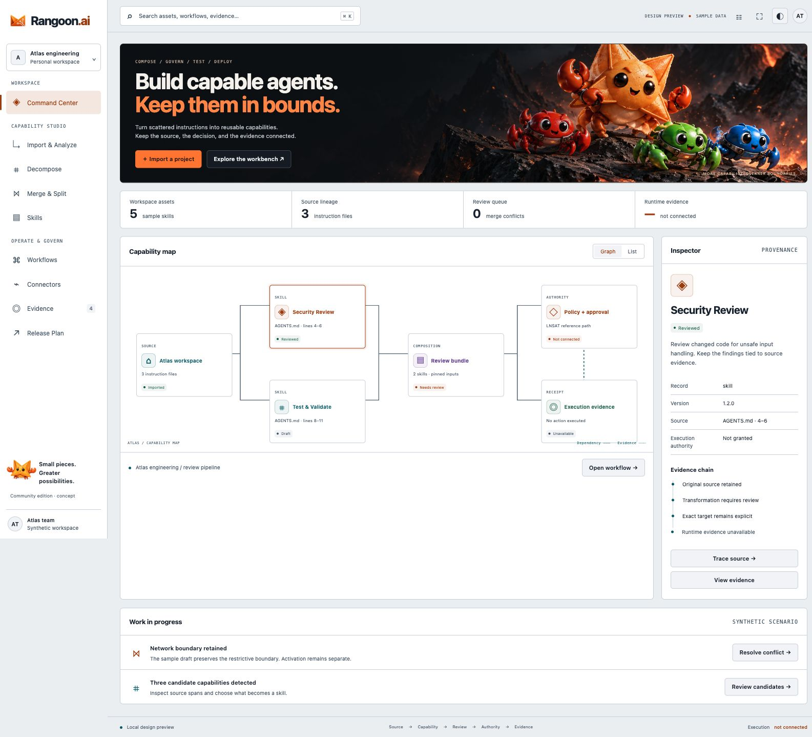

## Skills · light

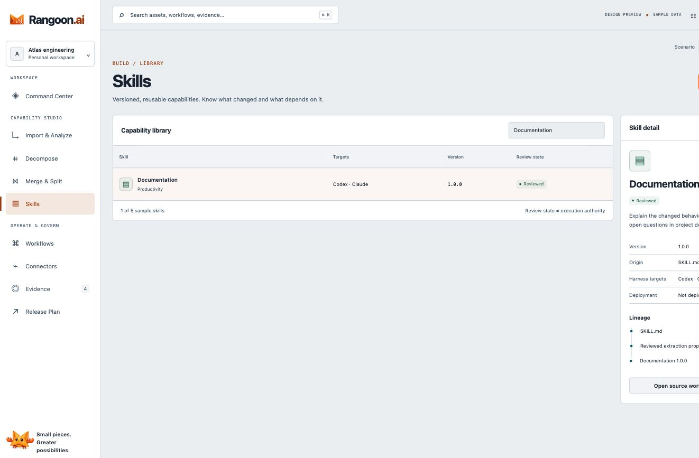

## Command Center · narrow

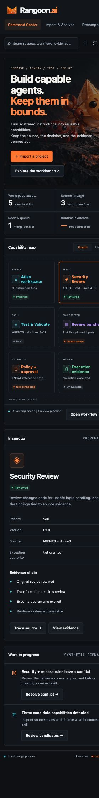
